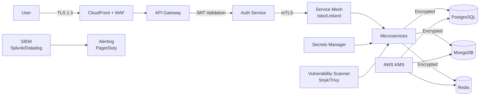

# 09 — Technical Architecture

**InvestIQ Product Research** | Version 1.0 | June 2026

---

## 1. Architecture Overview

```mermaid
graph TB
    subgraph "Client Layer"
        A1[React Native<br/>iOS + Android]
        A2[Next.js 15<br/>Admin Dashboard]
        A3[PWA<br/>Web Fallback]
    end

    subgraph "Edge Layer"
        B1[CloudFront CDN]
        B2[AWS WAF]
        B3[DDoS Protection<br/>AWS Shield]
    end

    subgraph "API Gateway"
        C1[Kong / AWS API Gateway]
        C2[Rate Limiter<br/>Redis]
        C3[Auth Middleware<br/>JWT Validation]
    end

    subgraph "Microservices"
        D1[Auth Service<br/>Java 21 + Spring Boot]
        D2[User Service<br/>Java 21 + Spring Boot]
        D3[Trade Service<br/>Java 21 + Spring Boot]
        D4[Wallet Service<br/>Java 21 + Spring Boot]
        D5[Market Data Service<br/>Java 21 + Spring Boot]
        D6[Notification Service<br/>Java 21 + Spring Boot]
        D7[AI Advisor Service<br/>Python 3.12 + FastAPI]
        D8[ML Scoring Service<br/>Python 3.12 + FastAPI]
        D9[Analytics Service<br/>Python 3.12 + FastAPI]
        D10[Background Jobs<br/>Python 3.12 + Celery]
    end

    subgraph "Event Bus"
        E1[Apache Kafka<br/>3 Brokers]
        E2[Schema Registry<br/>Confluent]
        E3[Kafka Connect]
    end

    subgraph "Data Layer"
        F1[(PostgreSQL 16<br/>Primary DB)]
        F2[(TimescaleDB<br/>Time-Series)]
        F3[(MongoDB<br/>AI Chats / Content)]
        F4[(Redis 7<br/>Cache / Sessions)]
        F5[(S3<br/>Documents / Backups)]
        F6[(OpenSearch<br/>Search / Logs)]
    end

    subgraph "AI / ML"
        G1[OpenAI API<br/>GPT-4o]
        G2[Anthropic API<br/>Claude 3.5]
        G3[Google API<br/>Gemini 1.5]
        G4[AWS SageMaker<br/>Custom Models]
        G5[pgvector<br/>Embeddings]
        G6[Pinecone<br/>Vector Search]
    end

    subgraph "External APIs"
        H1[SEBI-Registered Broker]
        H2[Account Aggregator<br/>Setu / OneMoney]
        H3[DigiLocker / CKYC]
        H4[UPI / NPCI]
        H5[NSE / BSE<br/>Market Data]
        H6[SMS / Email<br/>Twilio / SendGrid]
    end

    A1 --> B1
    A2 --> B1
    B1 --> B2
    B2 --> C1
    C1 --> C2
    C2 --> C3
    C3 --> D1
    C3 --> D2
    C3 --> D3
    C3 --> D4
    C3 --> D5
    C3 --> D6
    C3 --> D7
    C3 --> D8
    C3 --> D9
    C3 --> D10

    D1 --> E1
    D2 --> E1
    D3 --> E1
    D4 --> E1
    D5 --> E1
    D6 --> E1
    D7 --> E1
    D8 --> E1
    D9 --> E1
    D10 --> E1

    D1 --> F1
    D2 --> F1
    D3 --> F2
    D4 --> F1
    D5 --> F2
    D6 --> F1
    D7 --> F3
    D8 --> F3
    D9 --> F1
    D10 --> F1

    D1 --> F4
    D2 --> F4
    D3 --> F4
    D4 --> F4
    D5 --> F4
    D6 --> F4
    D7 --> F4

    D7 --> G1
    D7 --> G2
    D7 --> G3
    D7 --> G5
    D7 --> G6
    D8 --> G4
    D9 --> G4

    D3 --> H1
    D4 --> H4
    D2 --> H2
    D2 --> H3
    D5 --> H5
    D6 --> H6
```



---

## 2. Service Breakdown

### 2.1 Java 21 + Spring Boot 3.3 Services

| Service | Responsibility | Port | Database | Cache |
|---------|---------------|------|----------|-------|
| **Auth Service** | JWT/OAuth2, session management, MFA, device binding | 8081 | PostgreSQL | Redis |
| **User Service** | Profile, KYC status, risk profile, goals, preferences | 8082 | PostgreSQL | Redis |
| **Trade Service** | Order placement, SIP management, portfolio tracking, broker API integration | 8083 | PostgreSQL + TimescaleDB | Redis |
| **Wallet Service** | UPI integration, balance tracking, transaction history, reconciliation | 8084 | PostgreSQL | Redis |
| **Market Data Service** | NSE/BSE feed ingestion, real-time prices (15-min delay), historical data | 8085 | TimescaleDB | Redis |
| **Notification Service** | Push (FCM/APNS), SMS, email, WhatsApp Business API | 8086 | PostgreSQL | Redis |

**Why Java/Spring Boot?**
- Mature ecosystem for financial services (SEBI-grade audit trails)
- Strong typing reduces runtime errors in monetary calculations
- Excellent ORM (Hibernate) for complex relational data
- Battle-tested transaction management (ACID compliance)
- Native image support with GraalVM for cold-start optimization

### 2.2 Python 3.12 + FastAPI Services

| Service | Responsibility | Port | AI/ML Stack |
|---------|---------------|------|-------------|
| **AI Advisor Service** | RAG pipeline, chatbot, financial Q&A, document parsing | 9001 | LangChain, OpenAI, pgvector, Pinecone |
| **ML Scoring Service** | Risk scoring, churn prediction, safe-to-save calculation, fraud detection | 9002 | scikit-learn, XGBoost, Prophet, SageMaker |
| **Analytics Service** | User behavior analytics, A/B testing, cohort analysis, reporting | 9003 | Pandas, Polars, ClickHouse |
| **Background Jobs** | SIP execution, reconciliation, report generation, data cleanup | 9004 | Celery, Redis, PostgreSQL |

**Why Python/FastAPI?**
- AI/ML ecosystem (PyTorch, TensorFlow, scikit-learn)
- Async support for high-concurrency chatbot requests
- FastAPI's automatic OpenAPI documentation for API contracts
- Easy integration with LLM APIs and vector databases

---

## 3. Database Architecture

### 3.1 PostgreSQL 16 + TimescaleDB

**Why PostgreSQL?**
- ACID compliance for financial transactions
- TimescaleDB extension for time-series market data and SIP schedules
- Row-level security for multi-tenant data isolation
- Excellent JSONB support for semi-structured data
- PostGIS for location-based features (campus ambassador tracking)

**Schema Design Principles:**
1. **Immutable audit logs** — Every action logged, never updated
2. **Soft deletes** — `deleted_at` timestamp for DPDP compliance
3. **Encryption at rest** — All PII encrypted via AWS KMS
4. **Partitioning** — TimescaleDB hypertables for transactions, market data
5. **Read replicas** — 3 replicas for analytics, reporting, AI training

### 3.2 MongoDB

**Collections:**
- `ai_chats` — Session-based conversations (flexible schema)
- `learning_content` — Lessons, videos, quizzes (rapid iteration)
- `news_feed` — Market news, personalized filters
- `user_generated` — Community posts, comments, flags

**Why MongoDB?**
- Flexible schema for AI chat conversations
- Rapid iteration on content structure without migrations
- Horizontal scaling for high-write community features

### 3.3 Redis 7

**Use Cases:**
- Session management (JWT blacklisting)
- Rate limiting (sliding window, token bucket)
- Cache layer (frequently accessed user profiles, fund data)
- Pub/sub for real-time notifications
- Sorted sets for leaderboards
- Geospatial indexes for campus proximity

---

## 4. Event Bus: Apache Kafka

### 4.1 Why Kafka?

- **Event sourcing** — Every action is an immutable event
- **Decoupled microservices** — Trade events trigger analytics, notifications, AI
- **Exactly-once semantics** — Critical for financial transactions
- **Replay capability** — Debug and reconcile from event log

### 4.2 Topic Design

| Topic | Partitions | Retention | Consumers |
|-------|-----------|-----------|-----------|
| `user.signup` | 12 | 7 days | Analytics, CRM, AI |
| `user.kyc_complete` | 6 | 30 days | Compliance, Broker |
| `trade.order_placed` | 24 | 30 days | Trade, Wallet, Notification |
| `trade.order_executed` | 24 | 1 year | Portfolio, Analytics, Tax |
| `trade.sip_triggered` | 12 | 1 year | SIP Engine, Notification |
| `portfolio.rebalance_suggested` | 6 | 7 days | AI, Notification |
| `portfolio.goal_milestone` | 6 | 30 days | Notification, Gamification |
| `ai.chat_started` | 12 | 7 days | Analytics, ML |
| `ai.feedback_received` | 6 | 30 days | AI, Product |
| `notification.push` | 12 | 1 day | FCM, APNS, SMS |
| `notification.email` | 6 | 1 day | SendGrid, SES |
| `fraud.alert` | 6 | 1 year | Security, Compliance |
| `security.suspicious_login` | 6 | 1 year | Security, Auth |

### 4.3 Schema Registry

```json
{
  "type": "record",
  "name": "OrderPlaced",
  "namespace": "com.investiq.events",
  "fields": [
    {"name": "event_id", "type": "string"},
    {"name": "timestamp", "type": "long", "logicalType": "timestamp-millis"},
    {"name": "user_id", "type": "string"},
    {"name": "order_id", "type": "string"},
    {"name": "fund_id", "type": "string"},
    {"name": "amount", "type": "double"},
    {"name": "order_type", "type": "string"},
    {"name": "correlation_id", "type": "string"}
  ]
}
```

---

## 5. Authentication & Security

### 5.1 Auth Stack

| Layer | Technology | Purpose |
|-------|------------|---------|
| **Identity** | Clerk.dev / Auth0 / Custom JWT | Social login (Google), phone OTP, biometric |
| **MFA** | TOTP + SMS fallback | SEBI requirement for high-value actions |
| **Authorization** | RBAC + ABAC | Role-based + attribute-based (college, age, KYC status) |
| **API Security** | OAuth 2.0 + PKCE | Mobile app token flow |
| **Rate Limiting** | Redis + Bucket4j | 100 req/min standard, 10 req/min AI, 5 req/min transactions |
| **Encryption at Rest** | AWS KMS + AES-256 | All PII, PAN, Aadhaar encrypted |
| **Encryption in Transit** | TLS 1.3 + mTLS internal | Service-to-service mutual TLS |
| **Secrets Management** | AWS Secrets Manager / HashiCorp Vault | Rotate DB credentials, API keys |
| **WAF** | AWS WAF | OWASP Top 10, DDoS protection |

### 5.2 Security Architecture



---

## 6. DevOps & Infrastructure

### 6.1 Infrastructure Stack

| Component | Choice | Why |
|-----------|--------|-----|
| **Cloud** | AWS (Mumbai + Singapore DR) | Data residency, lowest latency |
| **Containers** | Docker + ECR | Consistent environments |
| **Orchestration** | Amazon EKS (Kubernetes) | Auto-scaling, self-healing |
| **CI/CD** | GitHub Actions → ArgoCD | GitOps deployment |
| **Monitoring** | Prometheus + Grafana + Datadog | Metrics, dashboards, alerting |
| **Logging** | ELK Stack / Loki + Grafana | Centralized log aggregation |
| **Tracing** | Jaeger / AWS X-Ray | Distributed tracing |
| **Alerting** | PagerDuty + Slack | On-call rotation |
| **Backup** | AWS Backup + cross-region replication | RPO 1 hour, RTO 4 hours |

### 6.2 CI/CD Pipeline

```mermaid
graph LR
    A[Developer Push] --> B[GitHub Actions]
    B --> C[Unit Tests<br/>JUnit + pytest]
    C --> D[Integration Tests<br/>TestContainers]
    D --> E[Security Scan<br/>Snyk + Trivy]
    E --> F[Build Docker Image]
    F --> G[Push to ECR]
    G --> H[ArgoCD Sync]
    H --> I[Staging Deploy]
    I --> J[E2E Tests<br/>Cypress + Detox]
    J --> K[Manual Approval]
    K --> L[Production Deploy]
    L --> M[Smoke Tests]
    M --> N[Monitoring<br/>Datadog]
```



---

## 7. Scalability Plan

### 7.1 Phase 1: MVP (0-100K users)

| Component | Spec | Cost/Month |
|-----------|------|------------|
| EKS Cluster | 3 nodes, t3.medium, 2 AZs | $300 |
| RDS PostgreSQL | db.r6g.large, single read replica | $400 |
| ElastiCache Redis | cache.r6g.large | $200 |
| Kafka | m5.large, 3 brokers | $500 |
| S3 + CloudFront | 500GB, 10TB transfer | $150 |
| **Total** | | **~$1,550** |

### 7.2 Phase 2: Growth (100K-1M users)

| Component | Spec | Cost/Month |
|-----------|------|------------|
| EKS Cluster | 10 nodes, m5.xlarge, 3 AZs | $1,500 |
| RDS PostgreSQL | db.r6g.2xlarge, 3 read replicas | $2,000 |
| TimescaleDB | Partition by month, 2TB | $800 |
| ElastiCache Redis | cache.r6g.xlarge, cluster mode | $600 |
| Kafka | m5.2xlarge, 5 brokers | $2,000 |
| OpenSearch | 3 nodes, r6g.large | $800 |
| **Total** | | **~$7,700** |

### 7.3 Phase 3: Scale (1M-10M users)

| Component | Spec | Cost/Month |
|-----------|------|------------|
| EKS Cluster | Multi-region, auto-scaling | $8,000 |
| RDS PostgreSQL | Sharded by user_id, 5 shards | $10,000 |
| TimescaleDB | Partition by day, 50TB | $5,000 |
| MongoDB | Sharded, 3 replica sets | $4,000 |
| ElastiCache Redis | Cluster mode, 10 nodes | $3,000 |
| Kafka | 10 brokers, 100 partitions/topic | $8,000 |
| CDN | Global edge locations | $2,000 |
| **Total** | | **~$40,000** |

---

## 8. Disaster Recovery

| Aspect | RPO | RTO | Implementation |
|--------|-----|-----|----------------|
| **Database** | 1 hour | 4 hours | Cross-region RDS replication, automated failover |
| **Application** | 0 | 15 minutes | Multi-AZ EKS, auto-scaling |
| **AI Services** | 0 | 30 minutes | Multi-region deployment, circuit breaker |
| **Market Data** | 15 minutes | 1 hour | NSE/BSE backup feeds, cached data |
| **Backups** | Daily | 24 hours | S3 cross-region replication, Glacier for archive |

---

## References

1. AWS Well-Architected Framework — Financial Services Lens
2. Kubernetes Documentation — Production Best Practices
3. TimescaleDB — Hypertables and Continuous Aggregates
4. Apache Kafka — Exactly-Once Semantics
5. OWASP — API Security Top 10 (2023)
6. SEBI — Cybersecurity Guidelines for Market Infrastructure (2024)
7. CERT-IN — Information Security Best Practices
8. HashiCorp Vault — Secrets Management
9. Istio — Service Mesh Architecture
10. Prometheus + Grafana — Monitoring Stack
