# 11 — Database Design

**InvestIQ Product Research** | Version 1.0 | June 2026

---

## 1. Entity Relationship Diagram

```mermaid
erDiagram
    USER ||--o{ PORTFOLIO : has
    USER ||--o{ GOAL : sets
    USER ||--o{ TRANSACTION : executes
    USER ||--o{ KYC_RECORD : submits
    USER ||--o{ NOTIFICATION_PREFERENCE : configures
    USER ||--o{ LEARNING_PROGRESS : tracks
    USER ||--o{ AI_CHAT_SESSION : starts
    USER ||--o{ ROUND_UP_SETTING : configures
    USER ||--o{ SIP_SCHEDULE : creates
    USER ||--o{ SPEND_CATEGORY : categorizes
    USER ||--o{ REFERRAL : generates

    PORTFOLIO ||--o{ HOLDING : contains
    PORTFOLIO ||--o{ REBALANCE_HISTORY : records
    PORTFOLIO ||--o{ PORTFOLIO_HEALTH_SCORE : tracks

    GOAL ||--o{ GOAL_CONTRIBUTION : receives
    GOAL ||--o{ GOAL_MILESTONE : achieves

    TRANSACTION ||--o{ ORDER : places
    TRANSACTION ||--o{ FEE_BREAKDOWN : details

    FUND ||--o{ HOLDING : held_in
    FUND ||--o{ TRANSACTION : traded_as
    FUND ||--o{ MARKET_DATA : priced_by
    FUND ||--o{ FUND_PERFORMANCE : tracks

    BROKER ||--o{ TRANSACTION : executes
    BROKER ||--o{ USER_ACCOUNT : holds

    COLLEGE ||--o{ USER : enrolls
    COLLEGE ||--o{ LEADERBOARD : ranks
    COLLEGE ||--o{ CAMPUS_AMBASSADOR : has

    AI_CHAT_SESSION ||--o{ AI_MESSAGE : contains
    AI_MESSAGE ||--o{ RAG_CITATION : references

    AUDIT_LOG ||--o{ USER : tracks
    AUDIT_LOG ||--o{ TRANSACTION : references

    COMMUNITY_GROUP ||--o{ COMMUNITY_POST : contains
    COMMUNITY_GROUP ||--o{ USER : has_members

    LESSON ||--o{ LEARNING_PROGRESS : tracked_by
    LESSON ||--o{ QUIZ : contains
    QUIZ ||--o{ QUIZ_ATTEMPT : has
```



---

## 2. Core Tables

### 2.1 users

```sql
CREATE TABLE users (
    id UUID PRIMARY KEY DEFAULT gen_random_uuid(),
    phone VARCHAR(15) UNIQUE NOT NULL,
    email VARCHAR(255),
    full_name VARCHAR(255) NOT NULL,
    date_of_birth DATE NOT NULL,
    age INT GENERATED ALWAYS AS (EXTRACT(YEAR FROM AGE(date_of_birth))) STORED,
    gender VARCHAR(20),

    -- Academic
    college_id UUID REFERENCES colleges(id),
    course VARCHAR(100),
    year_of_study INT,
    graduation_date DATE,

    -- Financial
    monthly_allowance DECIMAL(10,2),
    risk_profile VARCHAR(20) CHECK (risk_profile IN ('conservative','moderate','aggressive')),

    -- KYC
    kyc_status VARCHAR(20) DEFAULT 'pending' 
        CHECK (kyc_status IN ('pending','in_progress','verified','rejected')),
    pan_number VARCHAR(10) ENCRYPTED,
    aadhaar_mask VARCHAR(4),
    ckyc_number VARCHAR(20),

    -- Guardian (for minors)
    guardian_consent BOOLEAN DEFAULT FALSE,
    guardian_user_id UUID REFERENCES users(id),

    -- Preferences
    language_preference VARCHAR(10) DEFAULT 'en',
    dark_mode BOOLEAN DEFAULT TRUE,
    notification_opt_in BOOLEAN DEFAULT TRUE,

    -- Gamification
    level VARCHAR(20) DEFAULT 'seedling' 
        CHECK (level IN ('seedling','sprout','sapling','explorer','saver','investor','wealth_builder')),
    total_coins_earned INT DEFAULT 0,
    total_coins_redeemed INT DEFAULT 0,

    -- Metadata
    created_at TIMESTAMPTZ DEFAULT NOW(),
    updated_at TIMESTAMPTZ DEFAULT NOW(),
    deleted_at TIMESTAMPTZ, -- soft delete for DPDP
    is_active BOOLEAN DEFAULT TRUE,

    -- Constraints
    CONSTRAINT valid_phone CHECK (phone ~ '^\+91[0-9]{10}$')
);

-- Indexes
CREATE INDEX idx_users_phone ON users(phone);
CREATE INDEX idx_users_college ON users(college_id);
CREATE INDEX idx_users_kyc ON users(kyc_status);
CREATE INDEX idx_users_created ON users(created_at);
CREATE INDEX idx_users_level ON users(level);
CREATE INDEX idx_users_active ON users(is_active) WHERE is_active = TRUE;
```

### 2.2 portfolios

```sql
CREATE TABLE portfolios (
    id UUID PRIMARY KEY DEFAULT gen_random_uuid(),
    user_id UUID NOT NULL REFERENCES users(id) ON DELETE CASCADE,
    broker_account_id VARCHAR(100),

    -- Valuation
    total_value DECIMAL(15,2) DEFAULT 0,
    invested_value DECIMAL(15,2) DEFAULT 0,
    unrealized_pnl DECIMAL(15,2) DEFAULT 0,
    realized_pnl DECIMAL(15,2) DEFAULT 0,

    -- Health
    health_score INT DEFAULT 0 CHECK (health_score BETWEEN 0 AND 100),
    health_score_breakdown JSONB DEFAULT '{}',

    -- Allocation
    asset_allocation JSONB DEFAULT '{}',
    sector_allocation JSONB DEFAULT '{}',

    -- Rebalancing
    rebalancing_needed BOOLEAN DEFAULT FALSE,
    last_rebalanced_at TIMESTAMPTZ,

    -- Metadata
    created_at TIMESTAMPTZ DEFAULT NOW(),
    updated_at TIMESTAMPTZ DEFAULT NOW(),

    CONSTRAINT positive_values CHECK (total_value >= 0)
);

CREATE INDEX idx_portfolios_user ON portfolios(user_id);
CREATE INDEX idx_portfolios_health ON portfolios(health_score);
CREATE INDEX idx_portfolios_rebalance ON portfolios(rebalancing_needed) WHERE rebalancing_needed = TRUE;
```

### 2.3 goals

```sql
CREATE TABLE goals (
    id UUID PRIMARY KEY DEFAULT gen_random_uuid(),
    user_id UUID NOT NULL REFERENCES users(id) ON DELETE CASCADE,

    -- Goal Definition
    name VARCHAR(255) NOT NULL,
    description TEXT,
    category VARCHAR(50) CHECK (category IN (
        'emergency','education','device','travel','skill','vehicle','wedding','other'
    )),
    icon VARCHAR(100) DEFAULT 'default_goal',

    -- Financial
    target_amount DECIMAL(12,2) NOT NULL,
    current_amount DECIMAL(12,2) DEFAULT 0,
    monthly_contribution DECIMAL(10,2),

    -- Timeline
    deadline DATE,
    start_date DATE DEFAULT CURRENT_DATE,

    -- Priority & Allocation
    priority INT DEFAULT 1 CHECK (priority BETWEEN 1 AND 5),
    allocation_percentage DECIMAL(5,2) DEFAULT 100,

    -- Auto-features
    auto_step_up BOOLEAN DEFAULT FALSE,
    step_up_percentage DECIMAL(5,2) DEFAULT 10,
    step_up_frequency VARCHAR(20) DEFAULT 'semester' 
        CHECK (step_up_frequency IN ('monthly','quarterly','semester','yearly')),

    -- Status
    is_completed BOOLEAN DEFAULT FALSE,
    completed_at TIMESTAMPTZ,
    is_paused BOOLEAN DEFAULT FALSE,
    paused_at TIMESTAMPTZ,

    -- Metadata
    created_at TIMESTAMPTZ DEFAULT NOW(),
    updated_at TIMESTAMPTZ DEFAULT NOW()
);

CREATE INDEX idx_goals_user ON goals(user_id);
CREATE INDEX idx_goals_deadline ON goals(deadline);
CREATE INDEX idx_goals_completed ON goals(is_completed);
CREATE INDEX idx_goals_category ON goals(category);
CREATE INDEX idx_goals_active ON goals(user_id, is_completed, is_paused) 
    WHERE is_completed = FALSE AND is_paused = FALSE;
```

### 2.4 transactions (TimescaleDB Hypertable)

```sql
CREATE TABLE transactions (
    id UUID,
    user_id UUID NOT NULL,
    portfolio_id UUID REFERENCES portfolios(id),
    broker_id UUID REFERENCES brokers(id),

    -- Transaction Details
    type VARCHAR(20) CHECK (type IN (
        'buy','sell','sip','swp','stp','dividend','transfer','roundup','bonus','redemption'
    )),
    status VARCHAR(20) DEFAULT 'pending' CHECK (status IN (
        'pending','processing','completed','failed','cancelled','reversed'
    )),

    -- Asset
    asset_type VARCHAR(20) CHECK (asset_type IN (
        'equity','mf','etf','gold','fd','cash','bond','liquid'
    )),
    fund_id UUID REFERENCES funds(id),
    isin VARCHAR(12),

    -- Quantities
    quantity DECIMAL(15,6),
    price DECIMAL(15,6),
    amount DECIMAL(15,2) NOT NULL,
    currency VARCHAR(3) DEFAULT 'INR',

    -- Exchange IDs
    exchange_order_id VARCHAR(100),
    exchange_trade_id VARCHAR(100),

    -- Fees (itemized for transparency)
    stt DECIMAL(10,2) DEFAULT 0,
    brokerage DECIMAL(10,2) DEFAULT 0,
    gst DECIMAL(10,2) DEFAULT 0,
    stamp_duty DECIMAL(10,2) DEFAULT 0,
    exchange_transaction_charge DECIMAL(10,2) DEFAULT 0,
    sebi_turnover_fee DECIMAL(10,2) DEFAULT 0,
    dp_charge DECIMAL(10,2) DEFAULT 0,
    total_charges DECIMAL(10,2) GENERATED ALWAYS AS (
        stt + brokerage + gst + stamp_duty + exchange_transaction_charge + 
        sebi_turnover_fee + dp_charge
    ) STORED,
    net_amount DECIMAL(15,2) GENERATED ALWAYS AS (amount + total_charges) STORED,

    -- Goal Link
    goal_id UUID REFERENCES goals(id),
    sip_schedule_id UUID REFERENCES sip_schedules(id),

    -- Metadata
    metadata JSONB DEFAULT '{}',
    created_at TIMESTAMPTZ NOT NULL,
    updated_at TIMESTAMPTZ DEFAULT NOW(),

    PRIMARY KEY (id, created_at)
);

-- Convert to hypertable
SELECT create_hypertable('transactions', 'created_at', 
    chunk_time_interval => INTERVAL '7 days',
    if_not_exists => TRUE
);

-- Indexes
CREATE INDEX idx_transactions_user_time ON transactions(user_id, created_at DESC);
CREATE INDEX idx_transactions_status ON transactions(status);
CREATE INDEX idx_transactions_type ON transactions(type);
CREATE INDEX idx_transactions_fund ON transactions(fund_id);
CREATE INDEX idx_transactions_goal ON transactions(goal_id);
CREATE INDEX idx_transactions_sip ON transactions(sip_schedule_id);
CREATE INDEX idx_transactions_broker ON transactions(broker_id);
```

### 2.5 sip_schedules

```sql
CREATE TABLE sip_schedules (
    id UUID PRIMARY KEY DEFAULT gen_random_uuid(),
    user_id UUID NOT NULL REFERENCES users(id) ON DELETE CASCADE,
    portfolio_id UUID REFERENCES portfolios(id),
    fund_id UUID NOT NULL REFERENCES funds(id),
    goal_id UUID REFERENCES goals(id),

    -- Schedule
    amount DECIMAL(10,2) NOT NULL,
    frequency VARCHAR(20) DEFAULT 'monthly' CHECK (frequency IN (
        'daily','weekly','biweekly','monthly','quarterly'
    )),
    start_date DATE NOT NULL,
    end_date DATE,
    next_execution_date DATE NOT NULL,
    execution_day INT CHECK (execution_day BETWEEN 1 AND 31),

    -- Status
    status VARCHAR(20) DEFAULT 'active' CHECK (status IN (
        'active','paused','cancelled','completed','failed'
    )),

    -- Pause Management
    pause_count INT DEFAULT 0,
    max_pauses INT DEFAULT 3,
    last_paused_at TIMESTAMPTZ,

    -- Auto-features
    auto_step_up BOOLEAN DEFAULT FALSE,
    step_up_percentage DECIMAL(5,2),
    last_step_up_date DATE,

    -- UPI Mandate
    upi_mandate_id VARCHAR(100),
    upi_mandate_status VARCHAR(20) CHECK (upi_mandate_status IN (
        'pending','active','paused','revoked','expired'
    )),

    -- Metadata
    created_at TIMESTAMPTZ DEFAULT NOW(),
    updated_at TIMESTAMPTZ DEFAULT NOW()
);

CREATE INDEX idx_sip_user ON sip_schedules(user_id);
CREATE INDEX idx_sip_next_exec ON sip_schedules(next_execution_date);
CREATE INDEX idx_sip_status ON sip_schedules(status);
CREATE INDEX idx_sip_fund ON sip_schedules(fund_id);
CREATE INDEX idx_sip_active ON sip_schedules(user_id, status) WHERE status = 'active';
```

### 2.6 funds

```sql
CREATE TABLE funds (
    id UUID PRIMARY KEY DEFAULT gen_random_uuid(),
    amfi_code VARCHAR(20) UNIQUE,
    isin VARCHAR(12) UNIQUE,

    -- Identity
    name VARCHAR(255) NOT NULL,
    short_name VARCHAR(100),

    -- Classification
    category VARCHAR(50) CHECK (category IN (
        'equity_large_cap','equity_mid_cap','equity_small_cap',
        'equity_elss','equity_sectoral','equity_dividend_yield',
        'hybrid_aggressive','hybrid_conservative','hybrid_balanced',
        'debt_gilt','debt_corporate','debt_liquid','debt_short_term',
        'gold','index','etf','fund_of_funds','solution_oriented'
    )),
    sub_category VARCHAR(50),

    -- AMC
    amc_id UUID REFERENCES amcs(id),

    -- Financials
    expense_ratio DECIMAL(5,4),
    nav DECIMAL(12,6),
    nav_date DATE,
    aum DECIMAL(15,2),

    -- Risk
    risk_rating INT CHECK (risk_rating BETWEEN 1 AND 5),
    benchmark VARCHAR(100),

    -- Terms
    exit_load VARCHAR(50),
    exit_load_period INT, -- days
    min_investment DECIMAL(10,2) DEFAULT 100,
    sip_min DECIMAL(10,2) DEFAULT 100,

    -- Features
    is_direct BOOLEAN DEFAULT TRUE,
    is_active BOOLEAN DEFAULT TRUE,
    is_dividend_reinvestment BOOLEAN DEFAULT TRUE,

    -- ESG
    esg_score DECIMAL(4,2),
    esg_category VARCHAR(20) CHECK (esg_category IN ('A','B','C','D','E')),

    -- Holdings & Allocation
    sector_allocation JSONB,
    top_holdings JSONB,
    asset_allocation JSONB,

    -- Performance
    returns_1y DECIMAL(6,2),
    returns_3y DECIMAL(6,2),
    returns_5y DECIMAL(6,2),
    returns_since_inception DECIMAL(6,2),

    -- Metadata
    inception_date DATE,
    created_at TIMESTAMPTZ DEFAULT NOW(),
    updated_at TIMESTAMPTZ DEFAULT NOW()
);

CREATE INDEX idx_funds_category ON funds(category);
CREATE INDEX idx_funds_amc ON funds(amc_id);
CREATE INDEX idx_funds_risk ON funds(risk_rating);
CREATE INDEX idx_funds_active ON funds(is_active) WHERE is_active = TRUE;
CREATE INDEX idx_funds_esg ON funds(esg_score) WHERE esg_score IS NOT NULL;
CREATE INDEX idx_funds_returns ON funds(returns_1y DESC);
```

### 2.7 ai_chat_sessions

```sql
CREATE TABLE ai_chat_sessions (
    id UUID PRIMARY KEY DEFAULT gen_random_uuid(),
    user_id UUID NOT NULL REFERENCES users(id) ON DELETE CASCADE,

    -- Session Info
    session_title VARCHAR(255),
    context JSONB DEFAULT '{}',

    -- Risk & Quality
    risk_flags JSONB DEFAULT '[]',
    guardrail_violations INT DEFAULT 0,

    -- Feedback
    satisfaction_rating INT CHECK (satisfaction_rating BETWEEN 1 AND 5),
    user_feedback TEXT,

    -- Escalation
    is_escalated BOOLEAN DEFAULT FALSE,
    escalated_to UUID REFERENCES support_agents(id),
    escalated_at TIMESTAMPTZ,
    escalation_reason TEXT,

    -- Metadata
    created_at TIMESTAMPTZ DEFAULT NOW(),
    updated_at TIMESTAMPTZ DEFAULT NOW(),
    closed_at TIMESTAMPTZ
);

CREATE INDEX idx_ai_chat_user ON ai_chat_sessions(user_id);
CREATE INDEX idx_ai_chat_escalated ON ai_chat_sessions(is_escalated) WHERE is_escalated = TRUE;
CREATE INDEX idx_ai_chat_created ON ai_chat_sessions(created_at DESC);
```

### 2.8 ai_messages

```sql
CREATE TABLE ai_messages (
    id UUID PRIMARY KEY DEFAULT gen_random_uuid(),
    session_id UUID NOT NULL REFERENCES ai_chat_sessions(id) ON DELETE CASCADE,

    -- Content
    role VARCHAR(20) CHECK (role IN ('user','assistant','system','tool')),
    content TEXT NOT NULL,
    content_type VARCHAR(20) DEFAULT 'text' CHECK (content_type IN ('text','image','document','voice')),

    -- Model Info
    model VARCHAR(50),
    model_version VARCHAR(20),

    -- Performance
    tokens_used INT,
    prompt_tokens INT,
    completion_tokens INT,
    latency_ms INT,

    -- RAG
    retrieval_score DECIMAL(4,3),
    citations JSONB DEFAULT '[]',
    retrieved_documents JSONB DEFAULT '[]',

    -- Guardrails
    guardrail_passed BOOLEAN DEFAULT TRUE,
    guardrail_reason VARCHAR(255),
    guardrail_action VARCHAR(50) CHECK (guardrail_action IN ('allow','block','warn','escalate')),

    -- Feedback
    feedback_helpful BOOLEAN,
    feedback_notes TEXT,

    -- Metadata
    created_at TIMESTAMPTZ DEFAULT NOW()
);

CREATE INDEX idx_ai_messages_session ON ai_messages(session_id, created_at);
CREATE INDEX idx_ai_messages_guardrail ON ai_messages(guardrail_passed) WHERE guardrail_passed = FALSE;
CREATE INDEX idx_ai_messages_model ON ai_messages(model);
```

### 2.9 audit_logs (Immutable)

```sql
CREATE TABLE audit_logs (
    id UUID PRIMARY KEY DEFAULT gen_random_uuid(),

    -- Actor
    user_id UUID,
    session_id VARCHAR(255),
    device_id VARCHAR(255),

    -- Action
    action VARCHAR(100) NOT NULL,
    action_category VARCHAR(50) CHECK (action_category IN (
        'auth','kyc','transaction','portfolio','goal','sip',
        'notification','ai_chat','admin','security','data'
    )),

    -- Target
    entity_type VARCHAR(50) NOT NULL,
    entity_id UUID,

    -- Changes
    old_values JSONB,
    new_values JSONB,
    diff JSONB GENERATED ALWAYS AS (
        CASE 
            WHEN old_values IS NOT NULL AND new_values IS NOT NULL 
            THEN jsonb_diff(old_values, new_values)
            ELSE NULL
        END
    ) STORED,

    -- Context
    ip_address INET,
    user_agent TEXT,
    geo_location JSONB,

    -- Correlation
    correlation_id VARCHAR(255),
    request_id VARCHAR(255),

    -- Metadata
    created_at TIMESTAMPTZ DEFAULT NOW(),

    -- Partition by month for retention
    created_month VARCHAR(7) GENERATED ALWAYS AS (
        TO_CHAR(created_at, 'YYYY-MM')
    ) STORED
);

-- Partitioning
CREATE TABLE audit_logs_2026_06 PARTITION OF audit_logs
    FOR VALUES FROM ('2026-06-01') TO ('2026-07-01');
-- Auto-create monthly partitions via cron

-- Indexes
CREATE INDEX idx_audit_user ON audit_logs(user_id, created_at);
CREATE INDEX idx_audit_action ON audit_logs(action, created_at);
CREATE INDEX idx_audit_correlation ON audit_logs(correlation_id);
CREATE INDEX idx_audit_entity ON audit_logs(entity_type, entity_id);
CREATE INDEX idx_audit_month ON audit_logs(created_month);
```

---

## 3. Data Retention & Compliance

| Data Type | Retention Period | Action | Regulatory Basis |
|-----------|-----------------|--------|-----------------|
| Transaction records | 7 years | Archive to S3 Glacier | SEBI |
| KYC documents | Account lifetime + 5 years | Encrypt and archive | SEBI, DPDP |
| AI chat logs | 2 years | Anonymize after 1 year | DPDP |
| Audit logs | 7 years | Immutable storage | SEBI, IT Act |
| Market data | 5 years | Archive to S3 Glacier | SEBI |
| User PII (deleted account) | 30 days post-deletion | Secure wipe | DPDP |
| Notification logs | 1 year | Aggregate then delete | DPDP |
| Session tokens | 7 days (refresh), 15 min (access) | Auto-expire | Security |
| Spend transaction data | 3 years | Anonymize after 1 year | DPDP |
| Community posts | Account lifetime | Soft delete available | DPDP |

---

## 4. Security Tables

### 4.1 user_sessions

```sql
CREATE TABLE user_sessions (
    id UUID PRIMARY KEY DEFAULT gen_random_uuid(),
    user_id UUID NOT NULL REFERENCES users(id) ON DELETE CASCADE,

    -- Token
    refresh_token_hash VARCHAR(255) NOT NULL,
    access_token_jti VARCHAR(255),

    -- Device
    device_id VARCHAR(255),
    device_type VARCHAR(50),
    device_name VARCHAR(255),
    os_version VARCHAR(50),
    app_version VARCHAR(20),

    -- Location
    ip_address INET,
    geo_country VARCHAR(10),
    geo_city VARCHAR(100),

    -- Status
    is_active BOOLEAN DEFAULT TRUE,
    revoked_at TIMESTAMPTZ,
    revoked_reason VARCHAR(100),

    -- Timing
    created_at TIMESTAMPTZ DEFAULT NOW(),
    expires_at TIMESTAMPTZ NOT NULL,
    last_active_at TIMESTAMPTZ DEFAULT NOW()
);

CREATE INDEX idx_sessions_user ON user_sessions(user_id);
CREATE INDEX idx_sessions_active ON user_sessions(is_active) WHERE is_active = TRUE;
CREATE INDEX idx_sessions_device ON user_sessions(device_id);
```

### 4.2 security_events

```sql
CREATE TABLE security_events (
    id UUID PRIMARY KEY DEFAULT gen_random_uuid(),
    user_id UUID REFERENCES users(id),

    event_type VARCHAR(50) CHECK (event_type IN (
        'login_success','login_failed','mfa_challenge','mfa_failed',
        'password_changed','device_added','device_removed',
        'suspicious_login','account_locked','account_unlocked',
        'kyc_submitted','kyc_approved','kyc_rejected',
        'high_value_transaction','bulk_transaction','rapid_transaction'
    )),

    severity VARCHAR(20) CHECK (severity IN ('low','medium','high','critical')),

    -- Context
    ip_address INET,
    device_id VARCHAR(255),
    user_agent TEXT,
    geo_location JSONB,

    -- Details
    details JSONB,

    -- Resolution
    is_resolved BOOLEAN DEFAULT FALSE,
    resolved_at TIMESTAMPTZ,
    resolved_by UUID,
    resolution_notes TEXT,

    created_at TIMESTAMPTZ DEFAULT NOW()
);

CREATE INDEX idx_security_user ON security_events(user_id, created_at DESC);
CREATE INDEX idx_security_type ON security_events(event_type);
CREATE INDEX idx_security_severity ON security_events(severity);
CREATE INDEX idx_security_unresolved ON security_events(is_resolved) WHERE is_resolved = FALSE;
```

---

## 5. Performance Optimization

### 5.1 Query Patterns & Indexes

| Query Pattern | Table | Index | Type |
|-------------|-------|-------|------|
| User by phone | users | `phone` | B-tree, UNIQUE |
| Active SIPs due today | sip_schedules | `next_execution_date, status` | Partial, B-tree |
| User transactions (recent) | transactions | `user_id, created_at DESC` | Composite, B-tree |
| Portfolio holdings | holdings | `portfolio_id, fund_id` | Composite, B-tree |
| AI chat by user | ai_chat_sessions | `user_id, created_at DESC` | Composite, B-tree |
| Fund by category | funds | `category, is_active` | Partial, B-tree |
| Leaderboard by college | users | `college_id, level` | Composite, B-tree |
| Audit by month | audit_logs | `created_month` | B-tree |
| Security events | security_events | `user_id, created_at DESC` | Composite, B-tree |

### 5.2 Partitioning Strategy

| Table | Partition Key | Interval | Rationale |
|-------|--------------|----------|-----------|
| transactions | created_at | 7 days | High write volume, time-series queries |
| market_data | timestamp | 1 day | OHLCV data, historical analysis |
| audit_logs | created_month | 1 month | Compliance retention, bulk archive |
| notification_logs | created_at | 1 month | High volume, time-bound relevance |
| ai_messages | created_at | 1 month | Conversation history, GDPR deletion |

### 5.3 Caching Strategy

| Data | Cache | TTL | Invalidation |
|------|-------|-----|-------------|
| User profile | Redis | 15 min | On update |
| Fund NAV | Redis | 15 min | Market data feed |
| Portfolio valuation | Redis | 5 min | On transaction |
| AI chat context | Redis | 30 min | On session close |
| Leaderboard | Redis | 1 hour | On score change |
| Market indices | Redis | 5 min | Market data feed |
| Learning content | Redis | 24 hours | On CMS update |

---

## References

1. PostgreSQL 16 Documentation — Partitioning, JSONB, Row-Level Security
2. TimescaleDB Documentation — Hypertables, Continuous Aggregates
3. MongoDB Documentation — Schema Design Best Practices
4. Redis Documentation — Data Types, Persistence, Clustering
5. AWS RDS — PostgreSQL Best Practices for Financial Services
6. SEBI — Record Keeping Requirements for Investment Advisers
7. DPDP Act 2023 — Data Retention and Deletion Obligations
8. OWASP — Database Security Cheat Sheet
9. PCI DSS — Database Encryption Requirements
10. InvestIQ Internal DB Design Review (Jun 2026)
