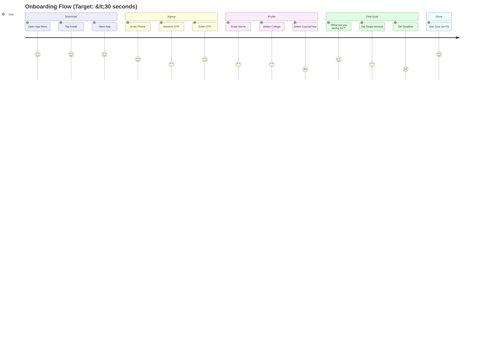
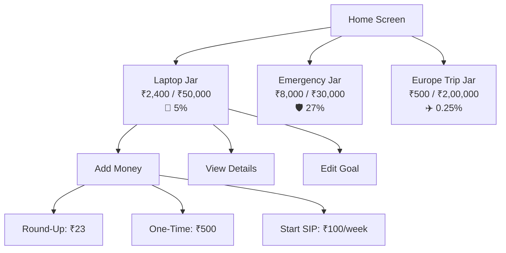

# 10 — UX Research & Design Guidelines

**InvestIQ Product Research** | Version 1.0 | June 2026

---

## 1. Design Philosophy

> **"Calm over chaos. Learning over trading. Progress over perfection."**

InvestIQ's UX is deliberately **anti-Robinhood**:
- No flashing prices or green/red ticker animations
- No confetti on trade execution (celebrate goals, not transactions)
- No "Top Movers" list encouraging momentum chasing
- No leverage or margin promotion

Instead:
- Gentle animations for goal completion
- Educational tooltips on every financial term
- Progress visualization that builds confidence
- Dark mode by default (Gen Z preference)

---

## 2. Onboarding UX

### 2.1 The 30-Second Rule

### 2.2 Progressive KYC Flow

| Stage | Trigger | Time | User Action |
|-------|---------|------|-------------|
| **Day 0** | App download | 0 min | None — full app access |
| **Day 3** | Goal set, ready to invest | 30 sec | Aadhaar OTP |
| **Day 7** | First SIP attempt | 2 min | Video KYC (selfie + liveness) |
| **Day 30** | Portfolio >₹10,000 | 1 min | Full CKYC (DigiLocker auto-fetch) |

### 2.3 Onboarding Screens

**Screen 1: Welcome**
- Hero: Animated seedling growing into tree
- Headline: "Plant your first financial seed"
- Sub: "Start with ₹10. Learn as you grow."
- CTA: "Get Started" (large, green)

**Screen 2: Phone**
- Auto-detect country code (+91)
- Large number pad
- "We'll send you a code"

**Screen 3: OTP**
- 6 boxes, auto-advance
- Resend countdown (30s)
- "Didn't receive? Call me"

**Screen 4: Profile**
- Name (first name only, friendly)
- College dropdown (searchable, 5,000+ colleges)
- Course + Year (auto-suggest based on college)

**Screen 5: First Goal**
- Goal templates: "Laptop", "Trip", "Emergency Fund", "Skill Course", "Custom"
- Visual icons (emoji-style illustrations)
- Target amount slider (₹1,000 to ₹5,00,000)
- Deadline picker (3 months to 5 years)

**Screen 6: Goal Jar**
- Empty jar animation
- "Your Laptop Jar is ready!"
- CTA: "Start Saving" or "Explore First"

---

## 3. Investment UX

### 3.1 Goal-Based Buckets

### 3.2 Jar Visualization

| State | Visual | Animation |
|-------|--------|-----------|
| **Empty** | Clear glass jar | Gentle float |
| **Filling** | Coins dropping in | Coin drop + splash |
| **25%** | Quarter full | Sparkle |
| **50%** | Half full | Confetti (subtle) |
| **75%** | Three-quarters | Glow effect |
| **100%** | Full, overflowing | Celebration animation |

### 3.3 Anti-F&O Design Principles

| Element | Robinhood | InvestIQ |
|---------|-----------|----------|
| Trade execution | Confetti, celebration | Simple confirmation toast |
| Price changes | Flashing green/red | Subtle color shift |
| Portfolio view | P&L front and center | Goal progress front and center |
| Notifications | "Your stock is up 10%!" | "You're 50% to your laptop goal!" |
| Leaderboards | Top traders by profit | Top savers by streak |
| Color psychology | Green = profit, Red = loss | Green = goal progress, Blue = stability |

---

## 4. Gamification Strategy

### 4.1 What to Gamify

| Feature | Gamification | Reward | Psychology |
|---------|-------------|--------|------------|
| **Savings Streaks** | 3, 7, 14, 30, 60, 90, 180, 365 days | Badge + coins | Loss aversion |
| **Learning Completion** | Lesson streak, module completion | Coins + certificate | Achievement |
| **Goal Milestones** | 25%, 50%, 75%, 100% | Animation + shareable | Progress principle |
| **Financial Health Score** | 0-100, improving over time | Level up (Beginner → Wealth Builder) | Mastery |
| **Community Challenges** | No-spend weekend, save ₹500 challenge | Badge + leaderboard | Social proof |

### 4.2 What NOT to Gamify

| Element | Why Not | Alternative |
|---------|---------|-------------|
| Number of trades | Encourages overtrading | Number of days SIP active |
| Trading volume | Risky behavior | Total amount saved |
| Individual stock performance | Creates anxiety | Portfolio diversification score |
| Referral count (alone) | Fake accounts | Referral + verified first SIP |

### 4.3 Level System

| Level | Name | Requirement | Unlocks |
|-------|------|-------------|---------|
| 1 | Seedling | Sign up | Basic features |
| 2 | Sprout | Complete 3 lessons | Goal creation |
| 3 | Sapling | First SIP | Round-ups |
| 4 | Explorer | 30-day SIP streak | AI coach access |
| 5 | Saver | ₹10,000 saved | Advanced analytics |
| 6 | Investor | Complete 20 lessons | ETF access |
| 7 | Wealth Builder | ₹1,00,000 saved | Pro features preview |

---

## 5. Empty States & Micro-Interactions

| State | Illustration | Copy | CTA |
|-------|-------------|------|-----|
| **No Portfolio** | Seedling in soil | "Every forest starts with one seed. Plant yours today." | "Start First SIP" |
| **No Goals** | Empty jar | "What are you dreaming of? A laptop? A trip? Let's build it." | "Create Goal" |
| **SIP Missed** | Gentle rain cloud | "It's okay. Even monsoons pass. Resume when ready." | "Resume SIP" |
| **Market Down** | Calm mountain | "Markets breathe in and out. Your SIP keeps climbing." | "View Portfolio" |
| **First Investment** | Seed → sprout animation | "You just planted your first seed. Watch it grow." | "Learn More" |
| **No Lessons** | Open book with light | "Knowledge is the best investment. Start learning." | "Browse Academy" |
| **No Community** | Empty campus | "Your college community is waiting. Join the conversation." | "Find My College" |

### 5.1 Haptic Feedback

| Action | Haptic | Sound |
|--------|--------|-------|
| SIP executed | Light tap | Subtle "ka-ching" |
| Goal reached | Success | Celebration chime |
| Lesson completed | Light tap | Page turn |
| Streak maintained | Double tap | Subtle bell |
| Error | Warning | Gentle buzz |

---

## 6. Accessibility

### 6.1 Standards

| Requirement | Implementation |
|-------------|---------------|
| **Font Size** | Dynamic Type (iOS) / sp scaling (Android). Min 14sp body, 16sp headings |
| **Color Blindness** | Portfolio charts use patterns + color. Not just green/red |
| **Screen Reader** | All icons labeled. Charts described with alt text |
| **Motor Accessibility** | Tap targets min 48dp. Swipe gestures optional |
| **Cognitive Load** | Max 3 options per screen. Progressive disclosure |
| **Contrast** | WCAG 2.1 AA minimum. 4.5:1 for normal text, 3:1 for large |

### 6.2 Vernacular UX

| Language | UI Direction | Font |
|----------|-------------|------|
| English | LTR | Inter / Roboto |
| Hindi | LTR | Noto Sans Devanagari |
| Tamil | LTR | Noto Sans Tamil |
| Telugu | LTR | Noto Sans Telugu |
| Marathi | LTR | Noto Sans Devanagari |
| Bengali | LTR | Noto Sans Bengali |

---

## 7. Dark Mode & Visual Design

### 7.1 Color System

| Token | Light Mode | Dark Mode | Usage |
|-------|-----------|-----------|-------|
| **Primary** | #10B981 | #34D399 | CTAs, progress, success |
| **Secondary** | #3B82F6 | #60A5FA | Links, info, AI coach |
| **Accent** | #F59E0B | #FBBF24 | Warnings, coins, streaks |
| **Danger** | #EF4444 | #F87171 | Errors, emergency fund |
| **Background** | #F9FAFB | #0F172A | App background |
| **Surface** | #FFFFFF | #1E293B | Cards, dialogs |
| **Text Primary** | #111827 | #F1F5F9 | Headlines |
| **Text Secondary** | #6B7280 | #94A3B8 | Body, captions |

### 7.2 Typography

| Role | Font | Size | Weight | Line Height |
|------|------|------|--------|-------------|
| H1 | Playfair Display | 32px | 700 | 1.2 |
| H2 | Playfair Display | 24px | 600 | 1.3 |
| H3 | Inter | 20px | 600 | 1.4 |
| Body | Inter | 16px | 400 | 1.5 |
| Caption | Inter | 12px | 400 | 1.4 |
| Button | Inter | 16px | 600 | 1.0 |

### 7.3 Motion Design

| Animation | Duration | Easing | Purpose |
|-----------|----------|--------|---------|
| Page transition | 300ms | ease-in-out | Smooth navigation |
| Jar fill | 800ms | spring | Rewarding progress |
| Coin drop | 500ms | bounce | Delight |
| Modal open | 200ms | ease-out | Context switch |
| Toast | 300ms + 3s hold | ease-in-out | Non-intrusive alert |
| Skeleton loading | 1.5s pulse | linear | Perceived performance |

---

## 8. Notification Strategy

### 8.1 Smart Windows

| Type | Window | Frequency | Content |
|------|--------|-----------|---------|
| **Goal Milestone** | 9 AM - 9 PM | As achieved | "50% to your laptop goal! 🎉" |
| **SIP Reminder** | 8 AM (day before) | Daily if due | "₹25 SIP tomorrow. You're on a 45-day streak!" |
| **Spending Alert** | 12 PM - 8 PM | Max 1/day | "You spent ₹2K on food this week." |
| **Market Summary** | 4 PM (market close) | Daily | "Nifty +0.8%. Your portfolio +1.2%." |
| **Learning Nudge** | 7 PM | 3x/week | "New lesson: Understanding NAV. Earn 50 coins!" |
| **AI Insight** | 10 AM | 2x/week | "Your safe-to-save this week: ₹350." |

### 8.2 Exam Mode

- Auto-detect exam periods from academic calendar
- Pause all non-essential notifications
- Only allow: SIP execution confirmation, security alerts
- Resume 24 hours after last exam

---

## 9. Design Inspiration References

| Platform | Element | Reference |
|----------|---------|-----------|
| **Dribbble** | Dashboard cards | Search: "fintech dashboard dark mode" |
| **Behance** | Onboarding flow | Search: "mobile app onboarding finance" |
| **Mobbin** | InvestIQ competitors | Screenshots: Groww, Jar, Jupiter |
| **Pinterest** | Goal visualization | Search: "savings jar UI design" |
| **Awwwards** | Micro-interactions | Search: "animation finance app" |

---

## References

1. Nir Eyal — Hooked: How to Build Habit-Forming Products
2. Daniel Kahneman — Thinking, Fast and Slow
3. Richard Thaler — Nudge: Improving Decisions About Health, Wealth, and Happiness
4. Material Design 3 — Google Design System
5. Apple Human Interface Guidelines — iOS Design
6. WCAG 2.1 — Web Content Accessibility Guidelines
7. Refactoring UI — Adam Wathan & Steve Schoger
8. Don't Make Me Think — Steve Krug
9. The Design of Everyday Things — Don Norman
10. InvestIQ Internal UX Research — 50 Student Interviews (May-Jun 2026)
