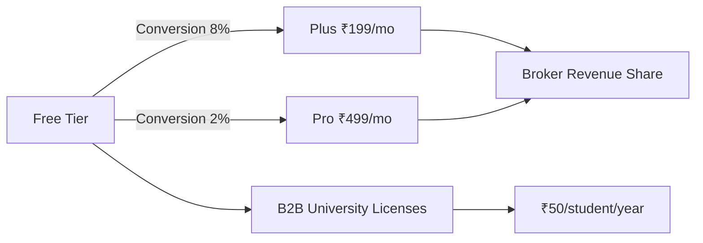

# 00 — Executive Summary

**InvestIQ** | AI-Powered Investment Platform for Indian College Students  
**Version**: 1.0  
**Date**: June 2026  
**Status**: Startup Product Research Document  

---

## 1. The Opportunity

India has **192.4 million demat accounts** (March 2025, 21.94% CAGR) yet **91% of retail F&O traders lose money**, with young traders under 30 facing the highest losses. Meanwhile, **70% of Gen Z investors are students** earning below ₹5,000/month, and financial literacy scores hover at just **38% correct answers**.

InvestIQ bridges this gap by being the **first investment platform that treats financial literacy as the primary product** and investing as the natural outcome.

## 2. What We Are Building

An AI-first, mobile-native, SEBI-compliant investment and financial wellness platform for Indian college students (18–25).

| Pillar | Description |
|--------|-------------|
| **Micro-Investing** | Start with ₹10. Round-ups, daily micro-SIPs, goal-based buckets |
| **AI Financial Coach** | RAG-based LLM advisor trained on SEBI/AMFI/RBI docs. No stock tips. No F&O. |
| **InvestIQ Academy** | Bite-sized, gamified financial education. Learn → Earn coins → Invest |
| **Behavioral Safety** | Anti-F&O guardrails, nudges that encourage saving, not trading |
| **Campus-Native** | College leaderboards, ambassador programs, vernacular support |

## 3. Target Market

| Segment | Metric |
|---------|--------|
| TAM | 40M+ Indian college students |
| SAM | 15M smartphone-enabled, UPI-active students in Tier-1/2 |
| SOM | 8M students in first 3 years |

## 4. Business Model

## 5. Key Differentiators

1. **No F&O, Ever** — We don't let students gamble. Period.
2. **Education-First** — You can't invest until you complete risk-aligned modules.
3. **AI RAG Coach** — Every answer cites SEBI/AMFI sources. Hallucination-proof.
4. **Micro-Native** — ₹10 minimums, daily SIPs, round-ups. Built for pocket money.
5. **Campus Ecosystem** — Peer learning, ambassador networks, college competitions.

## 6. Financial Projections (Conservative)

| Year | Users | Paying | MRR | Annual Revenue |
|------|-------|--------|-----|----------------|
| 1 | 200K | 16K | ₹4.8M | ₹6 Cr |
| 2 | 800K | 64K | ₹21M | ₹28.5 Cr |
| 3 | 2M | 160K | ₹58M | ₹77.6 Cr |

## 7. Regulatory Position

- **SEBI Registered Investment Advisor (RIA)** — Advisory-only, no brokerage license needed
- **DPDP Act 2023 Compliant** — Privacy-by-design, verifiable parental consent for <18
- **Account Aggregator Integration** — RBI-compliant data fetching, no screen scraping
- **No F&O Offering** — SEBI-aligned investor protection

## 8. Tech Stack Snapshot

| Layer | Technology |
|-------|------------|
| Mobile | React Native |
| Admin | Next.js 15 |
| Core Services | Java 21 + Spring Boot 3.3 |
| AI/ML | Python 3.12 + FastAPI |
| Primary DB | PostgreSQL 16 + TimescaleDB |
| Document Store | MongoDB |
| Cache | Redis 7 |
| Events | Apache Kafka |
| AI Models | GPT-4o / Claude 3.5 + RAG (pgvector) |
| Cloud | AWS Mumbai + Singapore DR |

## 9. Investment Ask

Seeking **$2.5M Seed** to build MVP, secure SEBI RIA license, launch in 5 colleges, and reach 200K users in Year 1.

---

**Next**: Read [01-Market-Research](01-Market-Research.md)
