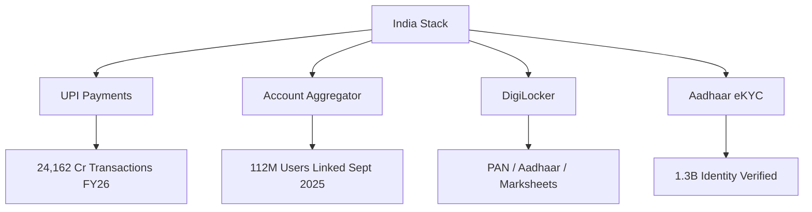
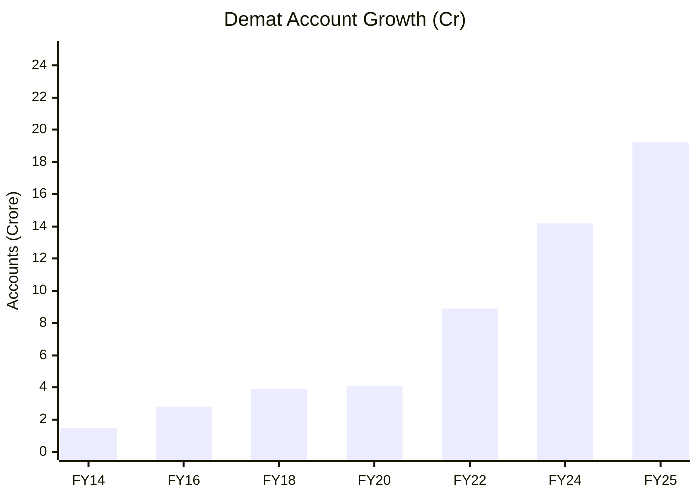
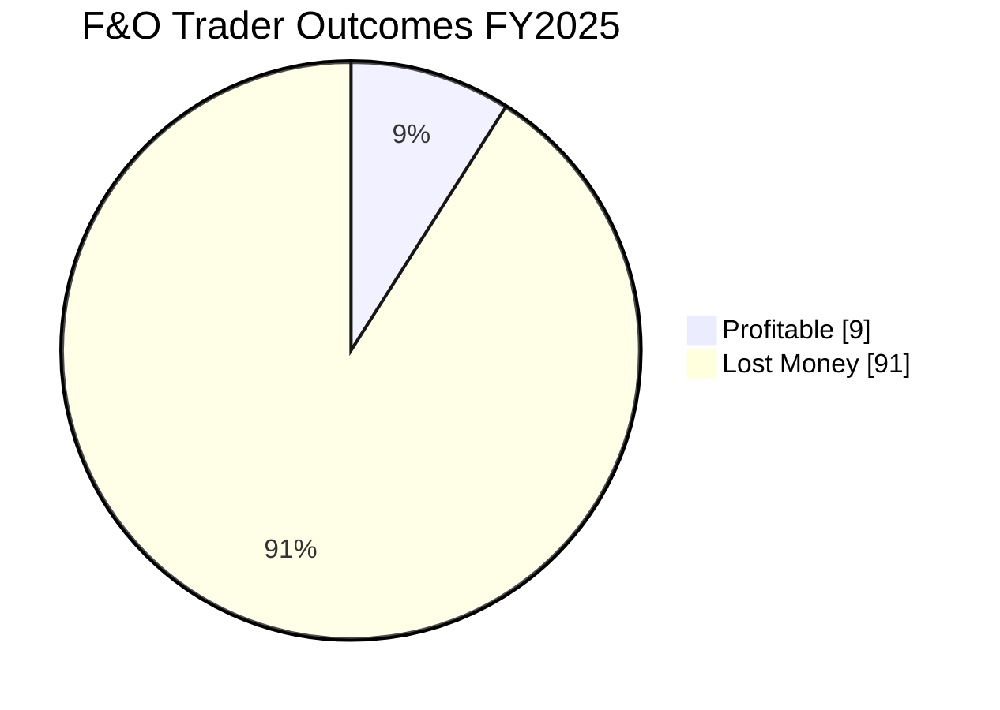
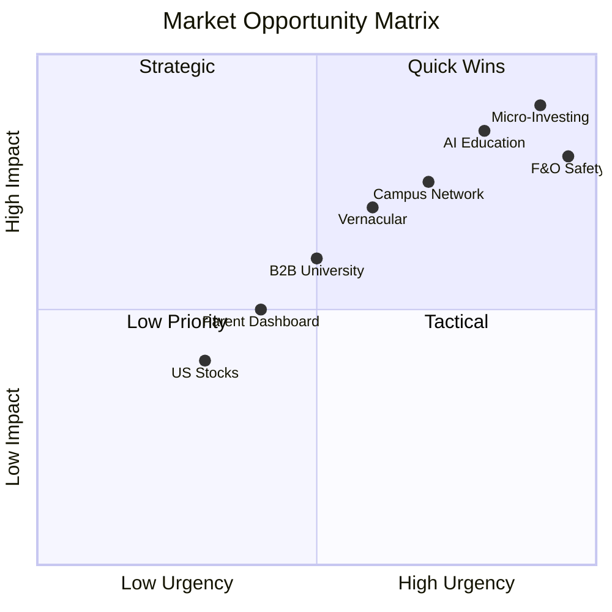

# 01 — Market Research

**InvestIQ Product Research** | Version 1.0 | June 2026

---

## 1. Indian FinTech Ecosystem

### Market Size & Growth

| Metric | Value | Source |
|--------|-------|--------|
| India Fintech Market 2025 | **$51.2 billion** | MarkNtel Advisors |
| Projected 2032 | **$145.57 billion** (16.1% CAGR) | MarkNtel Advisors |
| Digital Payments Share (H1 2025) | **99.8% of transaction volume** | Industry Reports |
| UPI FY2025-26 Transactions | **24,162 Crore** | PIB / NPCI |
| UPI FY2025-26 Value | **₹314 Lakh Crore** | PIB / NPCI |
| UPI Global Share | **49% of real-time payments** | Industry Analysis |

### Infrastructure Pillars

**Account Aggregator Framework**:
- 100M+ successful consents by July 2024
- 112M users linked by September 2025
- 2.2B+ financial accounts enabled for secure sharing
- Replaces broken screen-scraping models with explicit consent-based data flows

---

## 2. Investment Market in India

### Retail Investor Explosion

| Metric | Value | Period |
|--------|-------|--------|
| Demat Accounts | **192.4 Million** | March 2025 |
| Demat CAGR (FY14-FY25) | **21.94%** | 11 Years |
| NSE Registered Investors | **24 Crore** | November 2025 |
| New-Age Broker Market Share | **~70%** | March 2025 |
| Demat Penetration (India) | **13.4%** | March 2025 |

### Mutual Fund Growth

| Metric | Apr 2019 | Jan 2025 | Growth |
|--------|----------|----------|--------|
| Industry AUM | ₹24.78T | **₹68T** | **+175%** |
| Monthly SIP Contribution | ₹8,055 Cr | **₹26,400 Cr** | **+228%** |
| Unique Customers | 1.93 Cr | **5.33 Cr** | **+176%** |
| Retail Penetration | ~1.5% | **~3.6%** | — |

**AMFI Target**: 15% retail penetration by 2047 (Viksit Bharat).

### Geographic Distribution

| Rank | State | Investor Accounts | Share |
|------|-------|-------------------|-------|
| 1 | Maharashtra | 4 Cr+ | 17% |
| 2 | Uttar Pradesh | 2.7 Cr | 11% |
| 3 | Gujarat | 2.1 Cr | 9% |
| Top 5 | — | ~50% | — |
| Top 10 | — | >73% | — |

**B30 Cities**: AUM contribution rose from 9% to ~19%. Tier-2/3 growth is accelerating.

---

## 3. Student & GenZ Investing Trends

### GenZ Investor Profile (India)

| Attribute | Statistic |
|-----------|-------------|
| Students among GenZ Investors | **70%** |
| Earning below ₹5,000/month | **66.25%** |
| Started investing <1 year ago | **55%** |
| Primary Broker (Groww) | **38.75%** share |
| Knowledge of Option Greeks | **1.94 / 5** |
| Trust in Social Media Tips | **3.44 / 5** (skeptical) |

### Financial Literacy Crisis

| Study | Finding |
|-------|---------|
| TIAA-GFLEC Index 2025 | GenZ scored **lowest** among all age groups |
| Correct Answers (28 Qs) | **38%** |
| Topics Failed | Budgeting, inflation, compounding, risk diversification |
| Confidence vs Competence | High digital confidence, poor financial knowledge |

### College Student Spending (Metro Cities, 2025-26)

| Expense Category | Monthly Range |
|------------------|---------------|
| Total Monthly Expenses | **₹22,000 – ₹38,000** |
| Underestimation Gap | **30-40%** (irregular costs) |
| Basic Finance Confidence | **64%** feel confident |
| Desire to Learn More | **65%** want more personal finance education |
| Need Investment Advice | **56%** expect to need it upon graduation |

---

## 4. Risk Appetite & Behavioral Patterns

### The F&O Crisis

| Metric | Value | Source |
|--------|-------|--------|
| Retail F&O Loss Rate (FY2025) | **91%** | SEBI / Vivekam |
| Net Retail Losses (FY2025) | **₹1,05,603 Cr** | SEBI |
| Young Traders (<30) Loss Rate | **93%** | SEBI |
| Young Trader Share of F&O | **43%** (up from 31%) | SEBI |
| Average Loss per Trader | **₹2,00,000** | Industry Estimates |
| 3-Year Cumulative Losses | **₹1.8 Lakh Cr** | SEBI Study |

### Psychological Drivers

| Driver | Impact |
|--------|--------|
| **FOMO** | Overrides rational risk assessment in crypto/equity |
| **Social Media** | 52% buy via influencers; 85% discover products on social platforms |
| **Red Portfolio Normalization** | Students accept losses as standard; desensitized to risk |
| **Gamification Effects** | Bright colors, badges, instant notifications decrease emotional impact of losses |
| **Overconfidence** | Digital fluency mistaken for financial fluency |

---

## 5. UPI & Digital Payments

| Metric | Value |
|--------|-------|
| Daily Avg Transactions | **66 Crore** |
| Record Monthly (March 2026) | **2,264 Cr transactions** |
| Record Value (March 2026) | **₹29.53 Lakh Cr** |
| UPI Share of Digital Payments | **85%** |
| Individuals Served | **491 Million** |
| Merchants Served | **65 Million** |
| UPI Limit (Education/Capital Markets) | **₹5,00,000** |

---

## 6. Key Market Statistics Summary

| # | Metric | Value |
|---|--------|-------|
| 1 | India Fintech Market 2025 | $51.2B |
| 2 | Fintech Market 2032 (Proj) | $145.57B |
| 3 | UPI Annual Transactions FY26 | 24,162 Cr |
| 4 | UPI Annual Value FY26 | ₹314 Lakh Cr |
| 5 | Total Demat Accounts | 192.4M |
| 6 | NSE Registered Investors | 24 Cr |
| 7 | Mutual Fund AUM | ₹68T |
| 8 | Monthly SIP Contribution | ₹26,400 Cr |
| 9 | Retail F&O Loss Rate | 91% |
| 10 | GenZ Investors (Students) | 70% |
| 11 | GenZ Earning <₹5K/mo | 66.25% |
| 12 | Financial Literacy Score | 38% correct |
| 13 | Demat Penetration | 13.4% |
| 14 | AA Framework Users | 112M |
| 15 | Student Monthly Expenses | ₹22K–₹38K |
| 16 | F&O Losses FY2025 | ₹1.05 Lakh Cr |

---

## 7. Market Opportunity Sizing

---

## References

1. MarkNtel Advisors — India Fintech Market Report 2025-2032
2. PIB / NPCI — UPI 10 Years Report (November 2025)
3. PwC — Indian Payments Handbook 2025-2030
4. NSDL / CRISIL — Demat Account Industry Report (2025)
5. NSE — 24 Crore Investor Accounts Milestone (October 2025)
6. AMFI — The Mutual Funds Route to Viksit Bharat @2047 (2025)
7. AIJFR — Investment Behaviour and Financial Literacy of Gen Z (2026)
8. IJRISS — Generation Z Financial Literacy and Behaviour (2025)
9. CFP Board — Dollars & Sense: College Students and Personal Finances (Feb 2026)
10. IJEFM — Expenditure, Saving and Investment Behaviour of Gen Z (Aug 2025)
11. BeInCareer — How to Manage Money as a College Student (Mar 2026)
12. TapWell — Gen Z Statistics 2026
13. SEBI / Vivekam — Retail F&O Study FY2025
14. Times of India — Over 9 in 10 F&O Retail Traders Lose Money (Sep 2024)
15. Worldline — India Digital Payments Report (Apr 2026)
