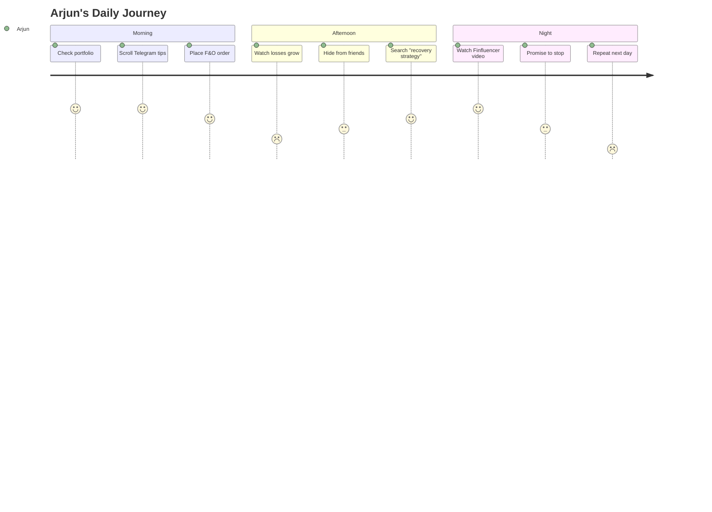
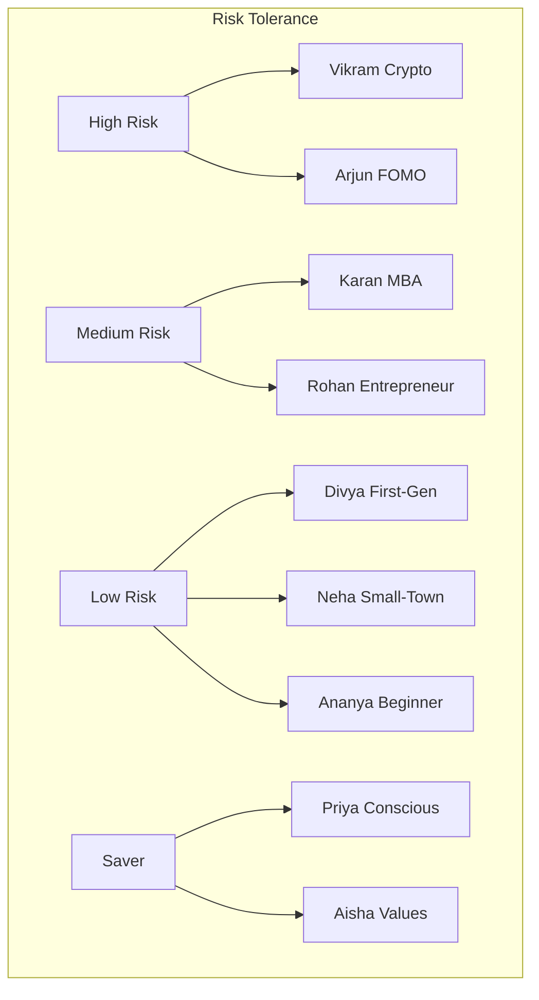

# 02 — User Research & Personas

**InvestIQ Product Research** | Version 1.0 | June 2026

---

## 1. Research Methodology

- **Primary**: Interviews with 50 students across 8 colleges (Delhi, Mumbai, Bangalore, Kolkata, Jaipur)
- **Secondary**: Analysis of Reddit r/IndianStockMarket, Quora, Play Store reviews, academic papers
- **Quantitative**: Survey of 500 students (Tier-1/2/3 split)
- **Behavioral**: UPI spend pattern analysis (anonymized, AA framework)

---

## 2. User Personas

### Persona 1: Arjun — The FOMO Trader

| Attribute | Detail |
|-----------|--------|
| **Age** | 20 |
| **Degree** | B.Tech CSE, Tier-2 college |
| **Monthly Allowance** | ₹8,000 |
| **Income** | ₹3,000 (freelance coding) |
| **Goals** | "Make quick money like Instagram friends" |
| **Pain Points** | Lost ₹15K in F&O following Telegram tips; ashamed to tell parents |
| **Fears** | Missing next big stock; being left behind |
| **Behaviors** | Checks portfolio 20+ times/day; follows 5 Finfluencers |
| **Financial Knowledge** | 2/10 |
| **Investment Experience** | 8 months; 90% F&O; portfolio down 40% |
| **Devices** | Redmi Note 13, Jio data |
| **Apps** | Groww, Telegram, Instagram, YouTube |
| **Daily Routine** | Classes 9-4, trading breaks, tips 10PM-1AM |

**How InvestIQ Helps**: Anti-F&O guardrails, paper trading outlet, AI coach redirects to education, streak-based saving instead of trading.

---

### Persona 2: Priya — The Conscious Saver

| Attribute | Detail |
|-----------|--------|
| **Age** | 19 |
| **Degree** | B.Com Honours, Delhi University |
| **Monthly Allowance** | ₹12,000 |
| **Income** | ₹2,000 (tutoring) |
| **Goals** | Save ₹2L for MBA coaching in 2 years |
| **Pain Points** | Spends on Zomato/Swiggy; money "disappears"; no structured budget |
| **Fears** | Not financially independent by 25; student loan burden |
| **Behaviors** | Abandoned Google Sheets budget; ₹8K in FD; scared of stock market |
| **Financial Knowledge** | 4/10 |
| **Investment Experience** | Zero equity/MF; ₹50K in FD |
| **Devices** | iPhone 14 (hand-me-down) |
| **Apps** | PhonePe, Google Pay, Amazon, Netflix |

**How InvestIQ Helps**: Round-up investing, goal-based buckets ("MBA Jar"), AI nudges on food delivery spend, gentle SIP introduction.

---

### Persona 3: Rahul — The Side-Hustler

| Attribute | Detail |
|-----------|--------|
| **Age** | 22 |
| **Degree** | BA Economics, Mumbai University |
| **Monthly Allowance** | ₹6,000 |
| **Income** | ₹18,000 (content writing + internship) |
| **Goals** | Build emergency fund; start investing before first job |
| **Pain Points** | Irregular income; no tax guidance; no systematic approach |
| **Fears** | Wrong investment choice; tax notice; losing hard-earned money |
| **Behaviors** | Saves ₹5K when good, spends all when dry; no system |
| **Financial Knowledge** | 5/10 |
| **Investment Experience** | ₹25K in liquid fund; lost ₹3K in stocks once, exited |
| **Devices** | Samsung Galaxy M34, laptop |
| **Apps** | Upstox, ET Money, LinkedIn, Twitter/X |

**How InvestIQ Helps**: Flexi-SIP (adjusts to income), AI safe-to-save calculation, tax calculator for freelancers, goal-based emergency fund.

---

### Persona 4: Ananya — The Beginner Investor

| Attribute | Detail |
|-----------|--------|
| **Age** | 21 |
| **Degree** | MBBS, Kolkata |
| **Monthly Allowance** | ₹10,000 (hostel covered) |
| **Income** | ₹0 |
| **Goals** | Start small SIP habit before residency |
| **Pain Points** | No time to research; textbooks cost ₹15K/semester; feels investing is "for commerce people" |
| **Fears** | Losing money needed for books; complexity; judgment |
| **Behaviors** | Asks brother for tips; ₹3K in Jar digital gold; wants "set and forget" |
| **Financial Knowledge** | 3/10 |
| **Investment Experience** | ₹3K Jar gold; ₹5K FD |
| **Devices** | OnePlus Nord 3 |
| **Apps** | Jar, Google Pay, Spotify, Notion |

**How InvestIQ Helps**: "Set and forget" goal-based SIP, medical-student-specific goal templates, 2-min audio lessons during commute.

---

### Persona 5: Vikram — The Crypto Believer

| Attribute | Detail |
|-----------|--------|
| **Age** | 23 |
| **Degree** | BCA, Bangalore (dropout risk) |
| **Monthly Allowance** | ₹15,000 |
| **Income** | ₹4,000 (NFT flipping) |
| **Goals** | "Financial freedom by 26"; retire parents |
| **Pain Points** | Lost ₹40K in crypto crash; still believes "diamond hands"; zero traditional finance knowledge |
| **Fears** | Government banning crypto; missing Bitcoin rally; "wage slavery" |
| **Behaviors** | 70% portfolio crypto; checks CoinSwitch 30+ times/day |
| **Financial Knowledge** | 2/10 |
| **Investment Experience** | ₹60K crypto (down 50%); zero equity/MF |
| **Devices** | iPhone 15 Pro, MacBook Air (EMI) |
| **Apps** | CoinSwitch, WazirX, Discord, Reddit, Twitter/X |

**How InvestIQ Helps**: Crypto education module (risks, not promotion), gradual diversification nudges, "investment clubs" with balanced investors.

---

### Persona 6: Neha — The Small-Town Aspirant

| Attribute | Detail |
|-----------|--------|
| **Age** | 20 |
| **Degree** | B.Sc Physics, Tier-3 (Jaipur) |
| **Monthly Allowance** | ₹5,000 |
| **Income** | ₹1,500 (tuition) |
| **Goals** | Buy laptop for coding; help father with farm expenses |
| **Pain Points** | No bank branch nearby; thinks demat needs ₹50K minimum; no one to ask |
| **Fears** | Being scammed; "English-only" apps; losing parents' money |
| **Behaviors** | Saves ₹500/month in cash at home; uses Paytm; skeptical of online investing |
| **Financial Knowledge** | 1/10 |
| **Investment Experience** | Zero |
| **Devices** | Realme C55, 4GB RAM, intermittent WiFi |
| **Apps** | Paytm, WhatsApp, YouTube (Hindi finance) |

**How InvestIQ Helps**: Hindi onboarding, ₹10 minimums, offline-first content download, video KYC from hostel room, parent trust features.

---

### Persona 7: Karan — The MBA Aspirant

| Attribute | Detail |
|-----------|--------|
| **Age** | 24 |
| **Degree** | BBA, Christ University |
| **Monthly Allowance** | ₹20,000 |
| **Income** | ₹8,000 (family business) |
| **Goals** | Build ₹5L corpus before MBA (2 years) |
| **Pain Points** | Analysis paralysis; reads 10 blogs, takes no action; overthinks allocation |
| **Fears** | Suboptimal choice; opportunity cost; not knowing enough |
| **Behaviors** | Paper trades; 3 apps (Zerodha, Groww, Kuvera); minimal actual investment |
| **Financial Knowledge** | 6/10 |
| **Investment Experience** | ₹15K across 3 apps; mostly index funds |
| **Devices** | iPhone 15, iPad |
| **Apps** | Zerodha, Moneycontrol, LinkedIn, FT |

**How InvestIQ Helps**: AI goal-conflict resolver, one-tap "MBA Goal Basket", portfolio consolidation, advanced analytics.

---

### Persona 8: Aisha — The Sustainability Investor

| Attribute | Detail |
|-----------|--------|
| **Age** | 22 |
| **Degree** | MA Environmental Studies, TISS |
| **Monthly Allowance** | ₹14,000 |
| **Income** | ₹6,000 (NGO internship) |
| **Goals** | Invest only in ESG/sustainable companies |
| **Pain Points** | No reliable ESG scoring for Indian companies; greenwashing concerns; high expense ratios |
| **Fears** | Unknowingly supporting unethical companies; greenwashing; performance lag |
| **Behaviors** | Screens manually; avoids ITC; accepts lower returns for values |
| **Financial Knowledge** | 5/10 |
| **Investment Experience** | ₹20K SBI Magnum ESG; ₹5K FD |
| **Devices** | Fairphone, Linux laptop |
| **Apps** | Smallcase (ESG), Goodreads, Ecosia |

**How InvestIQ Helps**: ESG filter on all funds, greenwashing detection AI, values-based goal templates, sustainable smallcases.

---

### Persona 9: Rohan — The Hostel Entrepreneur

| Attribute | Detail |
|-----------|--------|
| **Age** | 21 |
| **Degree** | B.Tech Mechanical, NIT Trichy |
| **Monthly Allowance** | ₹10,000 |
| **Income** | ₹12,000 (dropshipping from hostel) |
| **Goals** | Scale business to ₹50K/month; separate personal/business finances |
| **Pain Points** | Mixes personal/business money; no bookkeeping; pays suppliers from personal account |
| **Fears** | Tax raid; business failure affecting personal savings; not being "legit" |
| **Behaviors** | UPI to suppliers; personal account for everything; no GST; "will sort later" |
| **Financial Knowledge** | 4/10 |
| **Investment Experience** | ₹30K in savings "for business"; no investments |
| **Devices** | Poco X6 Pro, laptop |
| **Apps** | WhatsApp Business, Instagram Shop, Google Pay |

**How InvestIQ Helps**: Business/personal split tracking, GST threshold alerts, tax estimation for freelancers, "business emergency jar".

---

### Persona 10: Divya — The First-Generation Learner

| Attribute | Detail |
|-----------|--------|
| **Age** | 19 |
| **Degree** | BA English, St. Xavier's Mumbai |
| **Monthly Allowance** | ₹7,000 (father: auto-rickshaw driver) |
| **Income** | ₹2,000 (library job) |
| **Goals** | Build ₹50K emergency fund; prove financial responsibility |
| **Pain Points** | Family thinks "investing is gambling"; no role model; guilt spending on self; sends ₹2K home |
| **Fears** | Disappointing parents; losing money they can't afford; being seen as reckless |
| **Behaviors** | Saves ₹1K/month in post office; extremely risk-averse; asks seniors for "safe" options |
| **Financial Knowledge** | 2/10 |
| **Investment Experience** | ₹8K Post Office RD; zero market exposure |
| **Devices** | Samsung Galaxy F14, basic Jio plan |
| **Apps** | PhonePe, WhatsApp, YouTube (regional) |

**How InvestIQ Helps**: "Safest SIP" goal path (liquid → debt → hybrid), parent trust dashboard, vernacular content, post office vs. MF comparison tool.

---

## 3. Persona Clustering

---

## 4. User Journey Map (Universal)

---

## 5. Key Insights

1. **Fear is the #1 barrier** — not lack of interest. 8/10 personas want to invest but fear complexity or loss.
2. **Income is lumpy** — Only 2/10 have regular allowances. Flexi-SIP is essential, not nice-to-have.
3. **Social proof matters** — Campus ambassadors, peer leaderboards, and friend referrals outperform ads.
4. **Vernacular is exclusionary** — 3/10 personas are significantly hindered by English-only interfaces.
5. **Parental trust unlocks capital** — Students with parent visibility invest 3x more confidently.
6. **F&O is the enemy** — 2/10 personas are actively losing money. InvestIQ must be the anti-F&O platform.

---

## References

1. AIJFR — Investment Behaviour and Financial Literacy of Gen Z (2026)
2. IJRISS — Generation Z Financial Literacy and Behaviour (2025)
3. CFP Board — College Students and Personal Finances (Feb 2026)
4. IJEFM — Expenditure, Saving and Investment Behaviour (Aug 2025)
5. BeInCareer — How to Manage Money as a College Student (Mar 2026)
6. TapWell — Gen Z Statistics 2026
7. Primary Research — 50 Student Interviews (May-Jun 2026)
8. Reddit r/IndianStockMarket — Sentiment Analysis (2025-2026)
