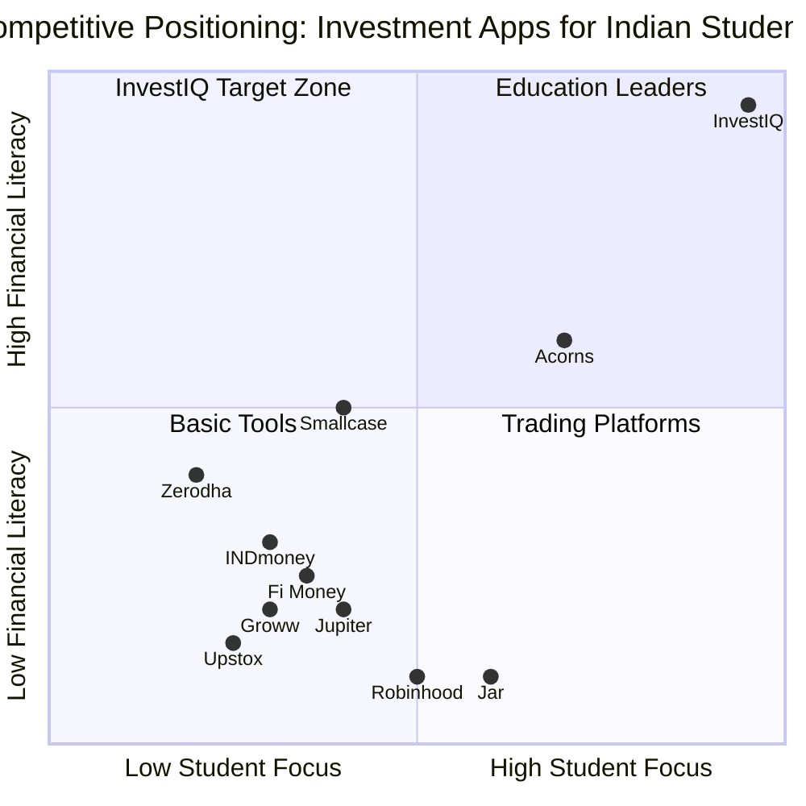
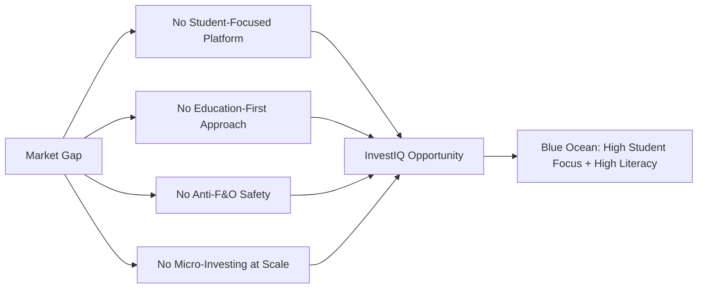

# 03 — Competitor Analysis

**InvestIQ Product Research** | Version 1.0 | June 2026

---

## Competitive Landscape Overview

---

## 3.1 Groww Analysis

### Company Overview

Groww is India's largest retail investment platform with **38.75% market share among Gen Z investors**. Founded in 2016, it democratized investing with zero-commission mutual funds and a clean mobile interface. Backed by Sequoia, Tiger Global, and Ribbit Capital.

| Attribute | Detail |
|-----------|--------|
| **Founded** | 2016 |
| **Headquarters** | Bangalore |
| **Users** | 40M+ registered |
| **AUM** | ₹80,000+ Crore |
| **Valuation** | $3B+ (Unicorn) |

### Target Audience

- Primary: Millennials and Gen Z first-time investors
- Age: 22-35
- Geography: Tier-1/2 cities
- Behavior: Mobile-first, social media influenced

### Core Features

| Feature | Available | Notes |
|---------|-----------|-------|
| Stocks (Equity) | ✅ | Zero brokerage on delivery |
| Mutual Funds | ✅ | Direct plans, zero commission |
| SIP | ✅ | Monthly, weekly, daily |
| F&O Trading | ✅ | Major concern for students |
| US Stocks | ✅ | Via Vested partnership |
| IPOs / NFOs | ✅ | |
| FDs | ✅ | Partner banks |
| Digital Gold | ✅ | Via MMTC-PAMP |
| AI Advisor | ❌ | Basic portfolio tracking only |
| Financial Education | ⚠️ | Passive blog content |
| Round-Up Investing | ❌ | |
| Goal-Based Investing | ⚠️ | Basic goal tracking |
| Student-Specific Features | ❌ | |
| Paper Trading | ❌ | |
| Parent Dashboard | ❌ | |

### Pricing

| Fee Type | Amount |
|----------|--------|
| Account Opening | ₹0 |
| AMC (Annual Maintenance) | ₹0 |
| Equity Delivery | ₹0 |
| Equity Intraday | ₹20/order or 0.05% |
| F&O | ₹20/order |
| Mutual Funds | ₹0 |
| US Stocks | $0.05/share (min $0.50) |

### User Experience

| Aspect | Rating | Notes |
|--------|--------|-------|
| Onboarding | ⭐⭐⭐⭐⭐ | 100% digital, <5 minutes |
| Mobile App | ⭐⭐⭐⭐⭐ | Clean, minimal, dark mode |
| Portfolio View | ⭐⭐⭐⭐ | Basic, no deep analytics |
| Education UX | ⭐⭐ | Blog-style, not interactive |
| Customer Support | ⭐⭐⭐ | Chatbot + email |

### Strengths

1. **Brand Recognition** — Dominant Gen Z mindshare
2. **Zero Fees** — No AMC, free delivery trading
3. **Product Breadth** — Stocks, MFs, US stocks, gold, FDs
4. **Execution Quality** — Reliable order placement
5. **Dark Mode** — Gen Z preference met

### Weaknesses

1. **No Education Layer** — Passive blogs, no structured learning
2. **F&O Accessibility** — Students can access high-risk products without education
3. **No Micro-Investing** — Minimum ₹100 for SIP, no round-ups
4. **No Behavioral Guardrails** — Gamification encourages trading, not saving
5. **No Student Features** — Generic platform, not tailored to college life
6. **No AI Advisor** — Basic tracking, no personalized guidance

### Revenue Model

- Brokerage (intraday/F&O)
- Payment for Order Flow (PFOF) on US stocks
- Float income on idle cash
- Partner commissions (gold, FDs)

### SWOT

| Strengths | Weaknesses |
|-----------|------------|
| Brand, simplicity, zero fees | No literacy layer, F&O push, no micro |
| Opportunities | Threats |
| Student segment, AI advisor | Regulatory crackdown on F&O, new entrants |

### Opportunities for InvestIQ

- Build the **education-first** alternative that Groww never prioritized
- **Anti-F&O positioning** — safety vs. speculation
- **Micro-investing** — ₹10 minimums vs. Groww's ₹100
- **Campus network** — peer learning that Groww lacks

### Final Verdict

Groww is the **market leader to beat** but has left a massive gap in student-focused financial education and safety. InvestIQ should not compete on trading features but on **trust, education, and micro-investing**.

---

## 3.2 Zerodha Analysis

### Company Overview

Zerodha is India's largest stockbroker by active clients. Founded in 2010 by Nithin Kamath, it pioneered discount broking. Known for transparency, low costs, and the Varsity education platform.

| Attribute | Detail |
|-----------|--------|
| **Founded** | 2010 |
| **Headquarters** | Bangalore |
| **Active Clients** | 7M+ (largest in India) |
| **Daily Turnover** | ₹30,000+ Crore |

### Target Audience

- Primary: Serious traders and DIY investors
- Age: 25-45
- Behavior: Self-directed, research-heavy, cost-conscious

### Core Features

| Feature | Available | Notes |
|---------|-----------|-------|
| Kite (Trading) | ✅ | Professional-grade |
| Coin (MFs) | ✅ | Direct plans, zero commission |
| Varsity (Education) | ✅ | Free, comprehensive, text-heavy |
| Sensibull (Options) | ✅ | Options analytics platform |
| Smallcase | ✅ | Thematic portfolios |
| Streak | ✅ | Algo trading (advanced) |
| Console (Reporting) | ✅ | Tax reports, capital gains |
| AI Advisor | ❌ | No AI, only analytics |
| Round-Up Investing | ❌ | |
| Goal-Based Investing | ⚠️ | Via Smallcase only |
| Student Features | ❌ | |
| Paper Trading | ❌ | |

### Pricing

| Fee Type | Amount |
|----------|--------|
| Account Opening | ₹200 |
| AMC | ₹300/year |
| Equity Delivery | ₹0 |
| Intraday/F&O | ₹20/order |
| Mutual Funds | ₹0 |

### Strengths

1. **Trust & Transparency** — Industry gold standard
2. **Lowest Costs** — ₹0 delivery, ₹20/order max
3. **Varsity Education** — Best free financial education in India
4. **Ecosystem** — Kite + Coin + Sensibull + Smallcase
5. **No PFOF** — Client-first, no conflict of interest

### Weaknesses

1. **Intimidating for Beginners** — Professional UI, data-dense
2. **No Micro-Investing** — Minimums too high for students
3. **Education is Passive** — Read-only, not interactive or gamified
4. **No AI Personalization** — One-size-fits-all content
5. **No Behavioral Features** — No nudges, streaks, or goal tracking

### Opportunities for InvestIQ

- **Beginner-friendly layer** on top of Zerodha's infrastructure
- **Active learning** — gamify Varsity's content
- **Micro-investing** — partner with Zerodha for execution while owning the student UX

### Final Verdict

Zerodha is the **trust benchmark**. InvestIQ should aspire to Zerodha's transparency while being the **anti-Zerodha in UX** — simple, friendly, and student-native.

---

## 3.3 Upstox Analysis

### Company Overview

Upstox is a discount broker backed by Tiger Global and Ratan Tata. Positioned as a modern alternative to traditional brokers.

| Attribute | Detail |
|-----------|--------|
| **Founded** | 2011 |
| **Users** | 10M+ registered |
| **Backers** | Tiger Global, Ratan Tata |

### Core Features

| Feature | Available |
|---------|-----------|
| Stocks | ✅ |
| MFs | ✅ |
| F&O | ✅ |
| IPOs | ✅ |
| MTF | ✅ |
| Digital Gold | ✅ |
| AI | ⚠️ Basic recommendations |

### Strengths

- Modern UI
- Fast execution
- Margin trading facility

### Weaknesses

- Pushy F&O promotion
- Customer service issues
- No literacy focus
- Cluttered with promotional content

### Final Verdict

**Avoid Upstox's mistakes** — aggressive F&O marketing and poor support. InvestIQ's calm, educational approach is the antidote.

---

## 3.4 INDmoney Analysis

### Company Overview

INDmoney is a "super-finance app" combining net worth tracking, investing, and financial planning. Uses Account Aggregator for holistic view.

| Attribute | Detail |
|-----------|--------|
| **Founded** | 2018 |
| **Users** | 10M+ |
| **Backers** | Tiger Global, Dragoneer |

### Core Features

| Feature | Available |
|---------|-----------|
| Net Worth Tracking | ✅ (AA-powered) |
| US Stocks | ✅ |
| Indian MFs | ✅ |
| FDs | ✅ |
| Insurance | ✅ |
| Loans | ✅ |
| AI Insights | ⚠️ Basic |
| Family Tracking | ✅ |

### Strengths

- Holistic financial view
- US stock access
- Family tracking
- AA integration

### Weaknesses

- Feature bloat — overwhelming for beginners
- Not student-focused
- Complex UI
- No micro-investing

### Final Verdict

INDmoney proves the **AA opportunity** but shows the risk of feature bloat. InvestIQ should stay focused and simple.

---

## 3.5 Jar Analysis

### Company Overview

Jar is India's leading micro-savings app, focused on digital gold via round-up investing. Simplest possible UX.

| Attribute | Detail |
|-----------|--------|
| **Founded** | 2021 |
| **Users** | 10M+ |
| **Concept** | Round-up UPI → Digital Gold |

### Core Features

| Feature | Available |
|---------|-----------|
| Round-Up Savings | ✅ |
| Digital Gold (24K 99.99%) | ✅ |
| Daily/Weekly Savings | ✅ |
| No Lock-In | ✅ |
| AI | ❌ |
| Equity/MF | ❌ |
| Education | ❌ |

### Pricing

| Fee | Amount |
|-----|--------|
| GST on Gold | 3% |
| Buy-Sell Spread | 2-3% |
| AMC | ₹0 |

### Strengths

- Lowest barrier (₹10)
- Extreme simplicity
- Habit formation
- No lock-in

### Weaknesses

- Single asset (gold only)
- No financial education
- Spreads eat returns
- No growth assets (equity/MF)
- No goal-based investing

### Final Verdict

Jar proves **micro-investing works in India**. InvestIQ should replicate the simplicity while adding **education, diversification, and growth assets**.

---

## 3.6 Jupiter / Fi Money Analysis

### Company Overview

Neo-banks offering zero-balance savings accounts with rewards and spend insights.

| Attribute | Jupiter | Fi Money |
|-----------|---------|----------|
| **Partner Bank** | Federal Bank | Federal Bank |
| **Key Feature** | 1% Jewels on UPI | FIT Rules (auto-save) |
| **Investing** | Basic MFs | Basic MFs |
| **Rewards** | UPI cashback | Debit card rewards |

### Strengths

- Sleek, gamified UX
- Banking + rewards in one
- UPI integration

### Weaknesses

- Not investment-focused
- Limited advisory
- No student-specific features
- No education layer

### Final Verdict

Neo-banks own **spending**. InvestIQ should own **saving and investing** — partner with them for banking, don't compete.

---

## 3.7 Smallcase Analysis

### Company Overview

Thematic/goal-based portfolio platform. Reduces decision fatigue with ready-made portfolios.

### Core Features

| Feature | Available |
|---------|-----------|
| Thematic Portfolios | ✅ |
| SIP in Themes | ✅ |
| Rebalance Alerts | ✅ |
| Broker Integration | ✅ |

### Strengths

- Reduces decision fatigue
- Thematic investing (ESG, IT, etc.)
- Good visualization

### Weaknesses

- Requires broker account
- Not for absolute beginners
- No micro-investing
- No student pricing

### Final Verdict

Smallcase is a **feature, not a platform**. InvestIQ could integrate Smallcase-like thematic baskets for advanced users.

---

## 3.8 Global Competitors

### Robinhood (US)

| Aspect | Detail |
|--------|--------|
| Features | Zero-commission stocks, options, crypto, fractional shares |
| Gamification | Confetti on trades, lottery rewards, streaks |
| Controversy | $7.5M fine (Massachusetts) for gamification encouraging excessive trading |
| MAU (Q3 2025) | 13.8M (25% YoY growth) |

**Lesson**: Gamification for **trading frequency is dangerous**. InvestIQ gamifies **saving and learning only**.

### Acorns (US)

| Aspect | Detail |
|--------|--------|
| Features | Round-up investing, automated portfolios, retirement |
| Pricing | $3-5/month subscription |
| Model | Proven micro-investing works |

**Lesson**: Subscription model viable for micro-investors. Round-ups are habit-forming.

### Plum (UK/EU)

| Aspect | Detail |
|--------|--------|
| AI | Predictive savings based on spending |
| Features | Round-ups, bill switching, pension optimization |

**Lesson**: AI can predict safe-to-save amounts without user input.

### Revolut

| Aspect | Detail |
|--------|--------|
| Users | 60M+ (Sept 2025) |
| Model | Super-app (banking, crypto, stocks, rewards) |

**Lesson**: Super-app works but risks feature bloat. Student discounts drive acquisition.

---

## 3.9 Competitor Comparison Matrix

| Feature | Groww | Zerodha | Upstox | INDmoney | Jar | Jupiter | Smallcase | InvestIQ |
|---------|-------|---------|--------|----------|-----|---------|-----------|----------|
| Stocks | ✅ | ✅ | ✅ | ✅ | ❌ | ⚠️ | ✅ | ⚠️ |
| Mutual Funds | ✅ | ✅ | ✅ | ✅ | ❌ | ⚠️ | ✅ | ✅ |
| F&O | ✅ | ✅ | ✅ | ❌ | ❌ | ❌ | ❌ | ❌ |
| US Stocks | ✅ | ❌ | ❌ | ✅ | ❌ | ❌ | ❌ | ⚠️ |
| Round-Ups | ❌ | ❌ | ❌ | ❌ | ✅ | ⚠️ | ❌ | ✅ |
| Micro-Investing | ❌ | ❌ | ❌ | ❌ | ✅ | ❌ | ❌ | ✅ |
| AI Advisor | ❌ | ❌ | ⚠️ | ⚠️ | ❌ | ⚠️ | ❌ | ✅ |
| Education | ⚠️ | ⚠️ | ❌ | ⚠️ | ❌ | ❌ | ❌ | ✅ |
| Goal-Based | ⚠️ | ⚠️ | ⚠️ | ✅ | ❌ | ⚠️ | ✅ | ✅ |
| Student Focus | ❌ | ❌ | ❌ | ❌ | ⚠️ | ❌ | ❌ | ✅ |
| Paper Trading | ❌ | ❌ | ❌ | ❌ | ❌ | ❌ | ❌ | ✅ |
| Parent Dashboard | ❌ | ❌ | ❌ | ❌ | ❌ | ❌ | ❌ | ✅ |
| Vernacular | ⚠️ | ⚠️ | ⚠️ | ⚠️ | ⚠️ | ⚠️ | ⚠️ | ✅ |
| Gamification | ⚠️ | ❌ | ⚠️ | ❌ | ❌ | ✅ | ❌ | ✅ |
| Community | ❌ | ❌ | ❌ | ❌ | ❌ | ❌ | ❌ | ✅ |
| Zero Brokerage | ✅ | ✅ | ✅ | ⚠️ | N/A | N/A | N/A | ✅ |

---

## 3.10 Strategic Insights

**Key Insight**: No competitor occupies the top-right quadrant (High Student Focus + High Financial Literacy). This is InvestIQ's blue ocean.

---

## References

1. Scribd — Groww vs Zerodha vs Upstox Comparison (Jun 2026)
2. Reddit r/IndianStockMarket — Broker Reviews & Sentiment
3. Groww Official Website — Pricing & Features
4. Zerodha Official Website — Kite, Coin, Varsity
5. Upstox Official Website — Features & Pricing
6. INDmoney Official Website — Super Finance App
7. Jar Official Website — Micro-Savings Platform
8. Jupiter Money Official Website — Neo-Banking
9. Fi Money Official Website — Digital Banking
10. Smallcase Official Website — Thematic Investing
11. News Aur Chai — Jar vs Gullak Comparison (Apr 2025)
12. OroPocket — Jar App Review (May 2026)
13. StriveCloud — Gamification for Investment Apps (Jun 2026)
14. BTLJ — Gamification of Investments US vs EU (Feb 2026)
15. CFA Institute — Investment Gamification Implications
