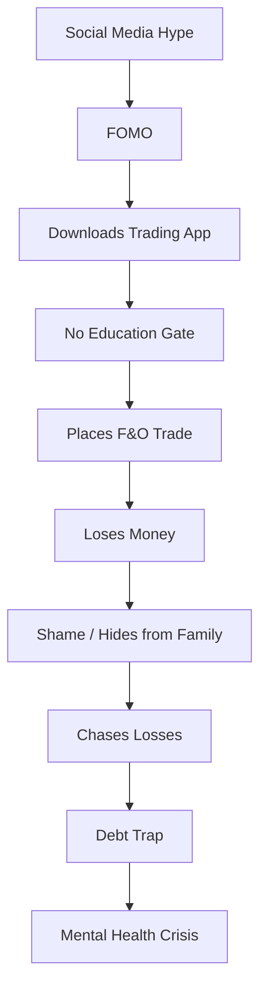
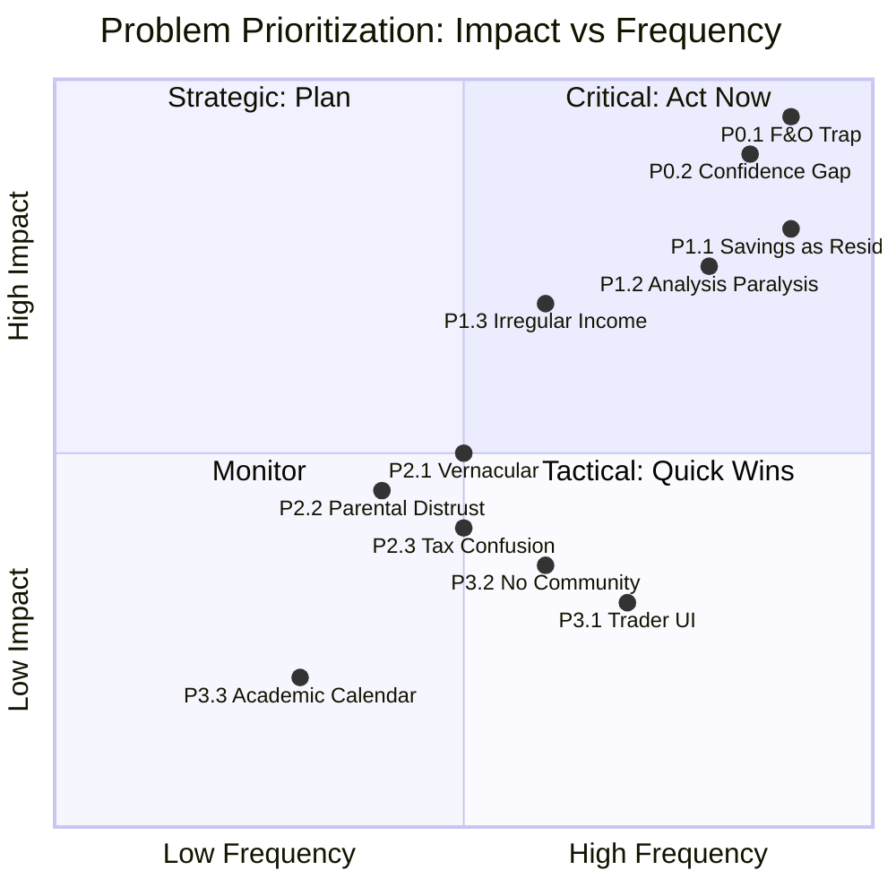
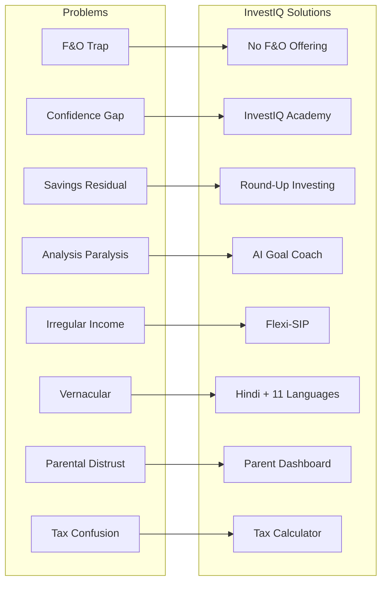

# 04 — Problem Statement

**InvestIQ Product Research** | Version 1.0 | June 2026

---

## 1. Problem Hierarchy

### P0: Critical (Existential Risk to Financial Wellbeing)

#### P0.1: The F&O Trap

| Attribute | Detail |
|-----------|--------|
| **Problem** | 91% of retail F&O traders lose money; 93% of under-30 traders lose; average loss ₹2 lakh |
| **Root Cause** | Platforms gamify trading; social media glorifies quick profits; no mandatory education before complex products |
| **Impact** | Generational wealth destruction, student debt traps, mental health crisis |
| **Evidence** | SEBI FY2025 study; 1.1 crore retail traders lost ₹1.8 lakh crore over 3 years |
| **Affected Personas** | Arjun (FOMO Trader), Vikram (Crypto Believer) |

#### P0.2: Confidence-Competence Gap

| Attribute | Detail |
|-----------|--------|
| **Problem** | GenZ shows high digital confidence but scores 38% on financial literacy |
| **Root Cause** | Digital fluency mistaken for financial fluency; apps enable action without understanding |
| **Impact** | Poor asset allocation, susceptibility to scams, inability to evaluate risk |
| **Evidence** | TIAA-GFLEC Index 2025; AIJFR GenZ Study 2026 |
| **Affected Personas** | All 10 personas, especially Arjun, Vikram, Neha |

### P1: Severe (Prevents Wealth Building)

#### P1.1: Savings as Residual

| Attribute | Detail |
|-----------|--------|
| **Problem** | Students treat savings as "what's left after spending" |
| **Root Cause** | No automated savings infrastructure; UPI makes spending frictionless but saving friction-full |
| **Impact** | Zero or negative savings rate; inability to handle emergencies |
| **Evidence** | 64% feel confident but 65% want to learn more; average student underestimates expenses by 30-40% |
| **Affected Personas** | Priya (Conscious Saver), Divya (First-Gen), Neha (Small-Town) |

#### P1.2: Analysis Paralysis

| Attribute | Detail |
|-----------|--------|
| **Problem** | Overwhelmed by 44 AMCs, 2,000+ MFs, 5,000+ stocks |
| **Root Cause** | Information asymmetry; no personalized filtering; fear of suboptimal choice |
| **Impact** | Money sits in savings accounts (3.5%) while inflation erodes at 5-6% |
| **Evidence** | Karan persona: reads 10 blogs, watches 5 videos, takes no action |
| **Affected Personas** | Karan (MBA Aspirant), Rahul (Side-Hustler) |

#### P1.3: Irregular Income Volatility

| Attribute | Detail |
|-----------|--------|
| **Problem** | Freelancers, interns, side-hustlers have lumpy income; can't commit to fixed SIPs |
| **Root Cause** | Traditional SIPs assume regular salary; no flexible micro-investing for variable income |
| **Impact** | Missed investment opportunities; guilt when skipping SIPs |
| **Evidence** | Rahul persona: saves ₹5K when good, spends all when dry |
| **Affected Personas** | Rahul (Side-Hustler), Rohan (Entrepreneur) |

### P2: Moderate (Friction & Exclusion)

#### P2.1: Vernacular Exclusion

| Attribute | Detail |
|-----------|--------|
| **Problem** | 90% of fintech apps are English-only; Tier-2/3 students feel excluded |
| **Root Cause** | Localization treated as translation, not cultural adaptation |
| **Impact** | 60% of India's youth in non-metro cities underserved |
| **Affected Personas** | Neha (Small-Town), Divya (First-Gen) |

#### P2.2: Parental Distrust

| Attribute | Detail |
|-----------|--------|
| **Problem** | First-generation students fear parental judgment; families view markets as gambling |
| **Root Cause** | No "training wheels" mode; no parent visibility into safe, small investments |
| **Impact** | Students hide losses; avoid investing entirely; miss compounding benefits |
| **Affected Personas** | Divya (First-Gen), Neha (Small-Town), Priya (Conscious Saver) |

#### P2.3: Tax & Compliance Confusion

| Attribute | Detail |
|-----------|--------|
| **Problem** | Students don't understand ITR filing, TDS, capital gains tax |
| **Root Cause** | Education system ignores practical finance; apps don't explain tax implications |
| **Impact** | Penalties; missed refunds; fear of regulatory action |
| **Affected Personas** | Rahul (Side-Hustler), Rohan (Entrepreneur) |

### P3: Minor (UX & Engagement)

| Problem | Impact | Affected |
|---------|--------|----------|
| P3.1: App interfaces designed for traders, not learners | Cognitive overload | Ananya (Beginner) |
| P3.2: No community for peer learning (non-Telegram tip groups) | Isolation | All |
| P3.3: No integration with academic calendars | Irregular engagement | All |

---

## 2. Problem Prioritization Matrix

| Problem | Frequency | Severity | Impact on InvestIQ | Priority |
|---------|-----------|----------|-------------------|----------|
| P0.1 F&O Trap | High | Critical | Core differentiator | **P0** |
| P0.2 Confidence Gap | High | Critical | Core mission | **P0** |
| P1.1 Savings as Residual | High | High | Key feature | **P1** |
| P1.2 Analysis Paralysis | High | High | AI opportunity | **P1** |
| P1.3 Irregular Income | Medium | High | Product feature | **P1** |
| P2.1 Vernacular | Medium | Medium | Growth lever | **P2** |
| P2.2 Parental Distrust | Medium | Medium | Trust feature | **P2** |
| P2.3 Tax Confusion | Medium | Medium | Value-add | **P2** |
| P3.1 Trader UI | High | Low | UX debt | **P3** |
| P3.2 No Community | Medium | Low | Engagement | **P3** |
| P3.3 Academic Calendar | Low | Low | Nice-to-have | **P3** |

---

## 3. Problem-Solution Mapping

---

## 4. Key Metrics to Track Problems

| Problem | Metric | Baseline | Target (Y1) |
|---------|--------|----------|-------------|
| P0.1 F&O Trap | % users who attempt F&O | N/A | 0% (never offered) |
| P0.2 Confidence Gap | Avg quiz score (0-100) | 38 | 65 |
| P1.1 Savings | Avg savings rate | 5% | 15% |
| P1.2 Analysis | Time to first investment | 30 days | 48 hours |
| P1.3 Irregular | SIP pause rate | 40% | 15% |
| P2.1 Vernacular | % non-English users | 10% | 30% |
| P2.2 Parental | % with parent linked | 0% | 20% |
| P2.3 Tax | Tax filing completion | 5% | 40% |

---

## References

1. SEBI / Vivekam — Retail F&O Study FY2025
2. TIAA-GFLEC — Personal Finance Index 2025
3. AIJFR — Investment Behaviour and Financial Literacy of Gen Z (2026)
4. BeInCareer — How to Manage Money as a College Student (Mar 2026)
5. IJEFM — Expenditure, Saving and Investment Behaviour (Aug 2025)
6. Primary Research — 50 Student Interviews (May-Jun 2026)
