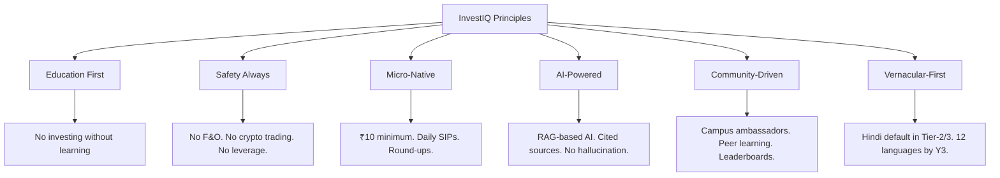
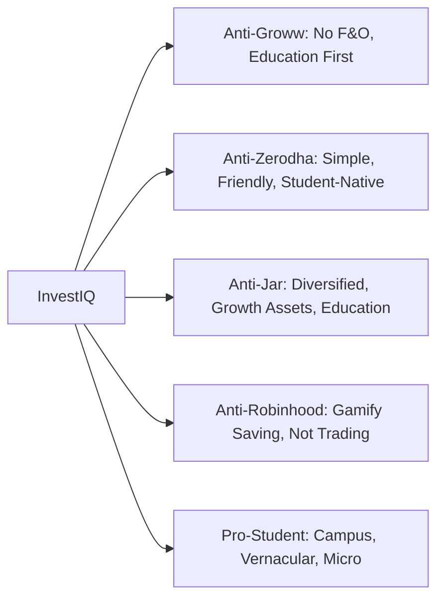

# 05 — Product Vision & Goals

**InvestIQ Product Research** | Version 1.0 | June 2026

---

## 1. Vision Statement

> **"Every Indian student will graduate with financial confidence, not debt."**

By 2035, InvestIQ will be the **Personal Finance Operating System** for 50 million Indian youth—combining AI-driven wealth coaching, autonomous investing, and financial literacy into a single, trusted platform.

## 2. Mission

To solve the financial literacy gap among Indian college students by:
1. **Teaching** before enabling
2. **Protecting** from predatory products (F&O, crypto speculation)
3. **Empowering** with micro-investing starting at ₹10
4. **Guiding** with AI that cites SEBI/AMFI sources
5. **Building** campus communities that normalize saving

## 3. Product Principles

## 4. North Star Metric

**"Financial Wellness Score Improvement"**

Composite: `(SIP Retention × Learning Completion × Goal Achievement × Portfolio Health) / 100`

| Milestone | Target |
|-----------|--------|
| Baseline (Day 0) | 20-30 |
| 3 Months | +10 points |
| 6 Months | +20 points |
| 12 Months | +30 points |
| Graduation | 70+ |

## 5. Product Goals (Year 1)

### Goal 1: Prove Product-Market Fit
- **KR1**: 100,000 registered users by Month 12
- **KR2**: 40% of signups start first SIP within 48 hours
- **KR3**: 50% of active users complete 10+ lessons

### Goal 2: Prove Unit Economics
- **KR1**: CAC < ₹150
- **KR2**: 8% free-to-paid conversion
- **KR3**: LTV/CAC > 20:1

### Goal 3: Prove Safety & Trust
- **KR1**: Zero regulatory violations
- **KR2**: NPS > 50
- **KR3**: 60% 12-month SIP retention

### Goal 4: Prove Campus Virality
- **KR1**: 100 campus ambassadors across 20 colleges
- **KR2**: 30% of new users from referrals
- **KR3**: Top 5 colleges have >5,000 users each

## 6. Product Goals (Year 3)

| Goal | Metric | Target |
|------|--------|--------|
| Scale | Users | 2,000,000 |
| AUM | Assets Under Management | ₹50 Crore |
| Revenue | Annual | ₹77.6 Crore |
| Literacy | Avg Quiz Score | 75/100 |
| Safety | F&O Attempt Rate | 0% |
| Community | Campus Ambassadors | 2,000 |
| Vernacular | Non-English Users | 40% |

## 7. Product Goals (Year 5 / 2030)

- **10 million users**
- **₹500 Crore AUM**
- **IPO-ready** (revenue ₹320 Cr, EBITDA positive)
- **Autonomous AI investing** (regulated framework)
- **Financial Digital Twin** for life scenario planning
- **InvestIQ Foundation** for rural financial inclusion

## 8. Value Proposition Canvas

### Customer Profile

| Jobs to be Done | Pains | Gains |
|-----------------|-------|-------|
| Save for goals (laptop, trip, MBA) | Fear of losing money | Financial independence |
| Learn investing safely | Complexity and jargon | Parental approval |
| Build saving habits | Irregular income | Peer recognition |
| Avoid F&O traps | Social pressure to trade | Confidence in decisions |
| Understand taxes | No guidance available | Career advantage |

### Value Map

| Products & Services | Pain Relievers | Gain Creators |
|-------------------|----------------|---------------|
| Micro-investing (₹10+) | No F&O access | Goal achievement celebrations |
| AI Financial Coach | Explains jargon simply | Personalized learning paths |
| InvestIQ Academy | Structured, bite-sized | LinkedIn-shareable certificates |
| Goal-Based Buckets | Visual progress tracking | Compound interest visualization |
| Campus Community | Peer support, not tips | Leaderboards, streaks, badges |
| Parent Dashboard | Transparency builds trust | Co-funding for big goals |

### Fit
**High** — No competitor offers this combination of education, safety, micro-investing, and community.

## 9. Strategic Positioning

---

## References

1. InvestIQ Internal Strategy Document (Jun 2026)
2. Y Combinator — How to Build a Startup (Series A Playbook)
3. Sequoia Capital — Arc Product-Market Fit Framework
4. Bessemer Venture Partners — State of the Cloud 2025
5. a16z — The Case for Vertical Fintech
