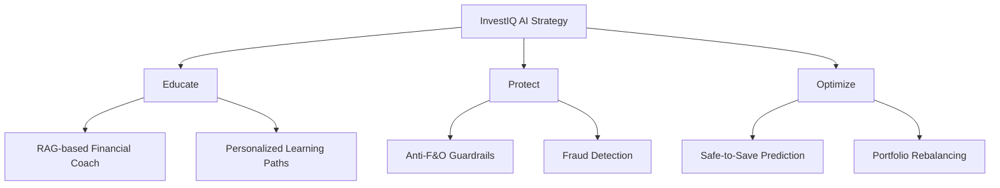
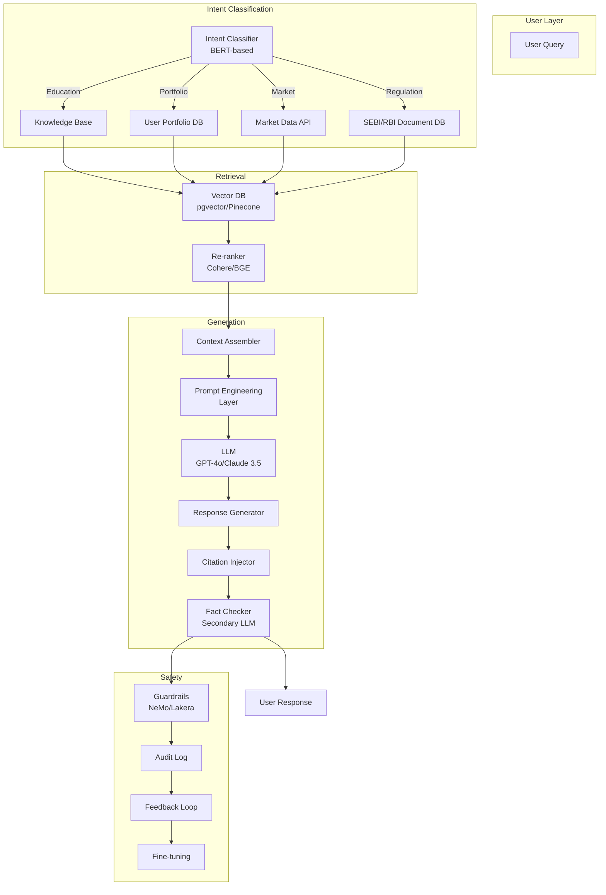
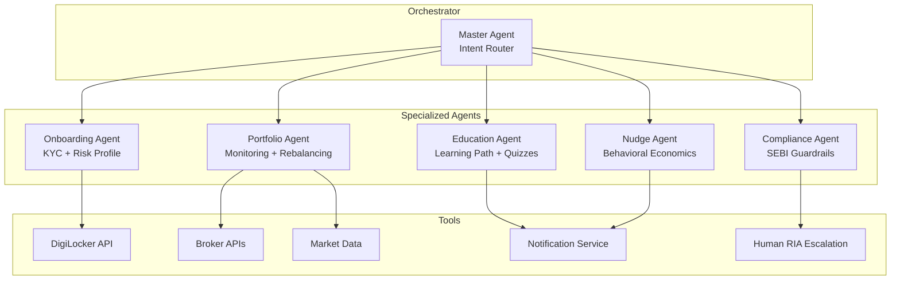
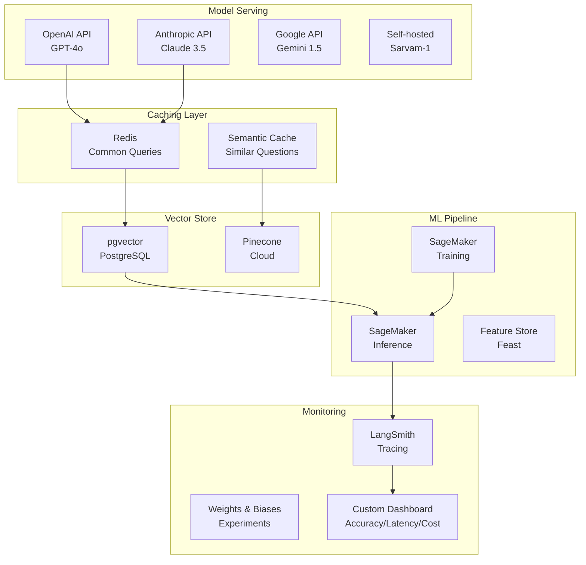

# 07 — AI Research & Architecture

**InvestIQ Product Research** | Version 1.0 | June 2026

---

## 1. AI Strategy Overview

InvestIQ's AI strategy is built on three pillars:



---

## 2. RAG-Based Financial Coach

### 2.1 Why RAG?

Standard LLMs hallucinate, lack financial domain knowledge, and cannot cite regulatory sources. RAG (Retrieval-Augmented Generation) combines generative power with precision by retrieving from verified documents before generating responses.

| Approach | Accuracy | Citations | Hallucination Risk | Cost |
|----------|----------|-----------|-------------------|------|
| Raw LLM | 60% | ❌ | High | Low |
| Fine-tuned LLM | 75% | ⚠️ | Medium | High |
| **RAG** | **95%** | **✅** | **Low** | **Medium** |
| RAG + Fine-tuning | 97% | ✅ | Very Low | Very High |

### 2.2 Architecture



### 2.3 Component Specifications

| Component | Technology | Purpose | Performance Target |
|-----------|------------|---------|-------------------|
| **Vector DB** | pgvector (PostgreSQL) + Pinecone (hybrid) | Store embeddings of SEBI docs, AMFI guides, InvestIQ lessons | <50ms retrieval |
| **Embeddings** | text-embedding-3-large (OpenAI) | Semantic search across vernacular content | 256k context |
| **LLM** | GPT-4o / Claude 3.5 Sonnet / Gemini 1.5 Pro | Response generation, reasoning | <1.5s response |
| **Re-ranker** | Cohere Rerank / BGE-reranker | Improve retrieval precision | +15% accuracy |
| **Guardrails** | NeMo Guardrails / Lakera | Prevent financial advice on specific stocks, F&O | 99.9% block rate |
| **PII Redaction** | Presidio / SpaCy NER | Mask Aadhaar, PAN, account numbers before LLM | 100% detection |
| **Fact Checker** | Secondary LLM (Claude Haiku) | Evaluate faithfulness of primary response | >0.9 score required |

### 2.4 Knowledge Base

| Document Type | Source | Update Frequency | Documents |
|---------------|--------|------------------|-----------|
| SEBI Circulars | sebi.gov.in | Daily | 5,000+ |
| AMFI Guidelines | amfiindia.com | Weekly | 500+ |
| RBI Notifications | rbi.org.in | Daily | 3,000+ |
| InvestIQ Lessons | Internal CMS | Real-time | 500+ |
| Tax Regulations | incometaxindia.gov.in | Annual | 200+ |
| Market Data | NSE/BSE | Real-time | — |

### 2.5 Prompt Engineering

**System Prompt (InvestIQ Coach):**
```
You are InvestIQ Coach, a SEBI-registered investment advisor assistant.
Your role is to educate users about financial concepts, explain how 
markets work, and guide them toward goal-based investing.

CRITICAL RULES:
1. NEVER recommend specific stocks, options, or F&O strategies.
2. NEVER predict stock prices or market direction.
3. ALWAYS cite SEBI/AMFI/RBI sources when discussing regulations.
4. ALWAYS encourage diversification and long-term investing.
5. If asked for specific investment advice, redirect to a human RIA.
6. Use simple language. Explain jargon. Be encouraging but honest about risks.
7. For portfolio questions, only discuss asset allocation, not individual securities.
8. If the user is under 18, include guardian consent reminders.
9. If the user shows signs of gambling behavior (chasing losses, F&O interest), 
   gently redirect to education and counseling resources.
```

**RAG Prompt Template:**
```
Context: {retrieved_documents}
User Question: {query}
User Profile: Age {age}, Risk {risk}, Goal {goal}, Experience {exp}

Instructions:
- Answer based ONLY on the provided context.
- If the answer is not in the context, say "I don't have enough information."
- Cite the source document name and section.
- Suggest a relevant InvestIQ Academy lesson if applicable.
- Keep response under 150 words for mobile readability.
- Use bullet points for lists.
```

### 2.6 Performance Benchmarks

| Metric | Target | Measurement |
|--------|--------|-------------|
| Response Accuracy | >95% | Human evaluation on 1,000 test queries |
| Citation Precision | >90% | Source document matches answer |
| Hallucination Rate | <1% | Secondary LLM evaluation |
| Response Latency (p95) | <2s | End-to-end from query to response |
| User Satisfaction | >4.2/5 | In-chat feedback |
| Escalation Rate | <5% | Human advisor handoff |

---

## 3. Multi-Agent System (Future)

### 3.1 Agent Architecture



### 3.2 Agent Specifications

| Agent | Responsibility | Tools | Triggers |
|-------|---------------|-------|----------|
| **Onboarding Agent** | KYC, document verification, risk profiling | DigiLocker, CKYC, Video KYC | New signup, KYC retry |
| **Portfolio Agent** | Monitor portfolio health, suggest rebalancing | Broker APIs, market data, rebalancing engine | Daily at 9AM, threshold breach |
| **Education Agent** | Personalize learning path, generate quizzes | CMS, quiz engine, progress tracker | Lesson completion, knowledge gap detected |
| **Nudge Agent** | Behavioral economics engine | Notification service, spend data, goal data | Spending threshold, market event, time-based |
| **Compliance Agent** | Scan all AI outputs for SEBI compliance | Guardrails, audit log, human escalation | Every AI response, daily batch review |

---

## 4. Behavioral AI & Nudges

### 4.1 Trigger Genome

| Signal | Weight | Data Source |
|--------|--------|-------------|
| Time of day | 0.05 | Device timestamp |
| Spending velocity (7-day) | 0.15 | Transaction data |
| Market volatility (VIX) | 0.10 | Market data API |
| Goal progress vs. target | 0.20 | Goal data |
| Recent app engagement | 0.10 | Analytics |
| Persona cluster | 0.15 | ML model |
| Exam period (academic calendar) | 0.15 | User profile |
| Sleep pattern (optional) | 0.10 | Health data (opt-in) |

### 4.2 Nudge Types

| Type | Example | Behavioral Principle | Effectiveness |
|------|---------|---------------------|---------------|
| **Impulse Control** | "You spent ₹800 on Zomato. Skip one order = ₹50 to your laptop goal." | Loss aversion | +25% savings |
| **Commitment Device** | "Lock this ₹1,000 in your emergency jar for 30 days?" | Pre-commitment | +30% retention |
| **Social Proof** | "Students like you saved ₹800 this week." | Normative influence | +20% engagement |
| **Loss Aversion** | "Skipping this SIP costs you ₹12,000 in 10 years." | Hyperbolic discounting | +15% SIP retention |
| **Mental Accounting** | "Your 'Laptop Jar' needs ₹500 more this month." | Category segregation | +18% goal completion |

### 4.3 Safety Rules

- No nudges during market hours (9:15 AM - 3:30 PM) to prevent trading FOMO
- No nudges after 9 PM to prevent anxiety
- Max 3 nudges per day
- User can disable any nudge category instantly
- All nudges A/B tested for ethical compliance

---

## 5. AI Model Selection

| Use Case | Primary Model | Fallback | Why |
|----------|--------------|----------|-----|
| General Chat | GPT-4o | Claude 3.5 Sonnet | Reasoning, safety, long context |
| Vernacular (Hindi) | Gemini 1.5 Pro | Sarvam-1 | Strong Indic language support |
| Embeddings | text-embedding-3-large | E5-multilingual | Multilingual, 256k context |
| Reranking | Cohere Rerank | BGE-reranker | Financial domain fine-tuning |
| Fraud Detection | XGBoost | Isolation Forest | Interpretable, fast, low latency |
| Spend Prediction | Prophet | LSTM | Seasonal patterns, explainable |
| Churn Prediction | CatBoost | XGBoost | Categorical features, SHAP values |
| Image OCR | PaddleOCR | Tesseract | Indian document layouts |
| Voice (ASR) | Whisper v3 | Sarvam ASR | Accent robustness |
| Voice (TTS) | ElevenLabs | Azure Neural | Indian voice profiles |
| Document Parsing | LayoutLM v3 | Donut | Structured document understanding |

---

## 6. AI Infrastructure



---

## 7. AI Safety & Guardrails

### 7.1 Hard Blocklist

| Category | Examples | Action |
|----------|----------|--------|
| Specific stock tips | "Buy Reliance at ₹2,500" | Block + redirect to education |
| F&O strategies | "Sell Nifty 23,000 CE" | Block + warning + resources |
| Guaranteed returns | "100% returns in 30 days" | Block + SEBI scam alert |
| Market timing | "Market will crash tomorrow" | Block + explain volatility |
| Unlicensed advice | Acting as RIA without registration | Block + human escalation |

### 7.2 Human-in-the-Loop

| Scenario | AI Action | Human Action |
|----------|-----------|--------------|
| Portfolio rebalancing >10% deviation | Suggest, don't execute | RIA approval required |
| User asks for specific fund recommendation | Provide 3 options with disclaimers | Human review within 24h |
| User shows gambling behavior (chasing losses) | Flag + provide counseling resources | Human outreach within 48h |
| AI confidence <70% | "I need to research this" | Human advisor responds |

### 7.3 Audit & Compliance

| Requirement | Implementation |
|-------------|---------------|
| Every AI interaction logged | Prompt, context, response, user_id, timestamp |
| 7-year retention | Immutable storage (S3 Glacier) |
| Monthly algorithmic fairness audit | Demographic bias check (gender, region, language) |
| SDF compliance (DPDP) | Algorithmic decision-making disclosure |
| Explainability | Every recommendation includes "Why" with cited sources |

---

## 8. Cost Estimates

| Component | Monthly Cost (1K users) | Monthly Cost (100K users) | Monthly Cost (1M users) |
|-----------|------------------------|--------------------------|------------------------|
| OpenAI API (GPT-4o) | $500 | $25,000 | $200,000 |
| Claude API | $300 | $15,000 | $120,000 |
| Vector DB (Pinecone) | $100 | $2,000 | $15,000 |
| Embedding API | $50 | $2,500 | $20,000 |
| SageMaker (training) | $200 | $5,000 | $30,000 |
| SageMaker (inference) | $100 | $3,000 | $20,000 |
| Redis (cache) | $50 | $500 | $3,000 |
| **Total AI Costs** | **~$1,300** | **~$53,000** | **~$408,000** |

**Cost Optimization:**
- Semantic caching: 40% reduction in LLM calls
- Model routing: Simple queries → GPT-3.5; Complex → GPT-4o
- Batch processing: Non-urgent tasks processed during off-peak
- Quantization: Self-hosted models with INT8 precision

---

## References

1. Zühlke — RAG in Finance: Building Trustworthy AI (Jan 2026)
2. Finextra — What is RAG in Fintech (Jul 2025)
3. IJERT — Personalized Finance Chatbot using RAG (Apr 2025)
4. Medium — AI-Powered Financial Advisory RAG Architecture (Mar 2025)
5. Tericsoft — Top 10 LLM RAG Architectures for FinTech (Jan 2026)
6. OpenAI — GPT-4o System Card
7. Anthropic — Claude 3.5 Sonnet Model Card
8. Google — Gemini 1.5 Pro Technical Report
9. NeMo Guardrails Documentation
10. Lakera AI — Guardrails for Financial Services
11. Morgan Stanley — AI @ Morgan Stanley Assistant Case Study
12. SEBI — Guidelines for Investment Advisers (2023)
13. Daniel Kahneman — Thinking, Fast and Slow (Behavioral Economics)
14. Richard Thaler — Nudge (Behavioral Design)
