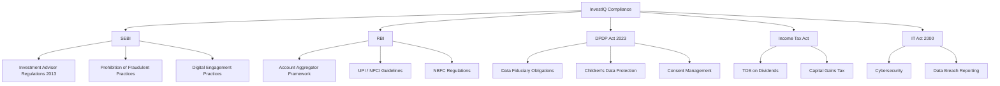
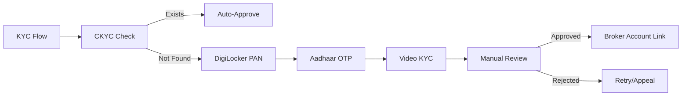

# 08 — Legal & Compliance Research

**InvestIQ Product Research** | Version 1.0 | June 2026

---

## 1. Regulatory Landscape Overview

---

## 2. SEBI Regulations

### 2.1 Investment Adviser Registration

| Requirement | Detail | InvestIQ Status |
|-------------|--------|-----------------|
| **Regulation** | SEBI (Investment Advisers) Regulations, 2013 | Required |
| **Entity Type** | Corporate (Pvt Ltd) | To be incorporated |
| **Net Worth** | ₹50 lakh (corporate) / ₹5 lakh (individual) | Arrange ₹50L |
| **Qualifications** | NISM Series X-A + X-B for all advisors | Hire certified advisors |
| **Registration Fee** | ₹1 lakh (non-refundable) | Budget allocated |
| **Renewal** | Annual, with compliance report | Process defined |

### 2.2 Key Obligations

| Obligation | Requirement | InvestIQ Implementation |
|------------|-------------|------------------------|
| **Segregation** | Advisory and execution must be separate | Partner with brokers; no proprietary trading |
| **Disclosure** | Conflicts, remuneration, risk profile | Automated disclosure in app |
| **Suitability** | Advice must match client's risk profile | AI enforces risk-aligned recommendations |
| **Record Keeping** | 5 years minimum | 7-year immutable audit trail |
| **Audit** | Annual internal audit | Quarterly + annual external audit |

### 2.3 Demat Account Rules for Students/Minors

| Rule | Detail | InvestIQ Compliance |
|------|--------|---------------------|
| **Minor Accounts** | Operated by guardian; no intraday/F&O | Block F&O for all; guardian flow for <18 |
| **BSDA** | Auto-converted if 1 demat + holdings <₹10L | Auto-detect and apply |
| **KYC Requirements** | PAN, address proof, photo, cancelled cheque, IPV | Video KYC integration |
| **Nomination** | Mandatory opt-out or nominate by March 2025 | Prompt during onboarding |
| **Fresh KYC at 18** | Minor accounts need re-KYC | Auto-trigger on 18th birthday |

### 2.4 F&O Restrictions (Critical)

| SEBI Action | Detail | InvestIQ Response |
|-------------|--------|-------------------|
| Increased lot sizes | To reduce speculative trading | N/A — we don't offer F&O |
| Enhanced disclosure | Brokers must report client losses | N/A — advisory only |
| Investor protection | SEBI discourages retail F&O | **Core differentiator: No F&O ever** |

### 2.5 Digital Engagement Practices (DEP) Warning

| Concern | Regulatory Action | InvestIQ Policy |
|---------|-------------------|-----------------|
| Gamification encouraging trading | Massachusetts fined Robinhood $7.5M | Gamify **saving/learning only** |
| Push notifications for trading | Under scrutiny globally | No trade alerts; only goal/saving nudges |
| Confetti on trade execution | Banned in some jurisdictions | Celebrate **goal completion**, not trades |
| Leaderboards for trading volume | Risk of herding behavior | Leaderboards for **savings streaks only** |

---

## 3. RBI Guidelines

### 3.1 Account Aggregator Framework

| Aspect | Requirement | InvestIQ Implementation |
|--------|-------------|------------------------|
| **Consent** | Explicit, granular, time-bound | UI with toggle-per-purpose |
| **Data Flow** | FIP → AA → FIU (no storage at AA) | Verify AA partner compliance |
| **Consent Artefact** | Identity, data nature, purpose, recipients, expiry, digital signature | Auto-generate, store encrypted |
| **Revocation** | User can revoke anytime | 1-tap revoke in settings |
| **No Screen Scraping** | AA replaces PDF upload / scraping | Full AA integration |

### 3.2 UPI / NPCI Guidelines

| Aspect | Limit | InvestIQ Usage |
|--------|-------|----------------|
| **Default UPI Limit** | ₹1 lakh | Standard transactions |
| **Enhanced Limit** | ₹5 lakh (education, capital markets) | SIP mandate, large investments |
| **UPI Autopay** | Required for recurring payments | SIP automation |
| **Mandate Management** | User consent, revocable | Dashboard with all mandates |

### 3.3 Neo-Banking Partnership (Future)

| Requirement | Detail | Timeline |
|-------------|--------|----------|
| **Partner Bank** | Scheduled Commercial Bank | Year 2 |
| **Deposit Insurance** | DICGC up to ₹5 lakh | Via partner bank |
| **No Direct Deposit Taking** | InvestIQ cannot hold deposits | Use partner bank accounts |

---

## 4. Data Privacy: DPDP Act 2023

### 4.1 Compliance Timeline

| Phase | Deadline | Requirement | Status |
|-------|----------|-------------|--------|
| **Phase 1** | Nov 2025 | Data Protection Board operational | In force |
| **Phase 2** | Nov 2026 | Consent Manager integration | In progress |
| **Phase 3** | May 2027 | Full substantive compliance | Planning |

### 4.2 Key Obligations

| Obligation | Detail | InvestIQ Implementation |
|------------|--------|------------------------|
| **Data Fiduciary Registration** | Register with Data Protection Board | File on incorporation |
| **DPO Appointment** | Significant Data Fiduciary must appoint DPO | Hire DPO before launch |
| **Consent** | Explicit, granular, withdrawable | Toggle-per-purpose UI |
| **Children's Data** | Verifiable parental consent for <18 | Guardian flow for minors |
| **Breach Notification** | 72 hours to Board + users | Automated incident response |
| **Data Principal Rights** | Access, correction, erasure, portability | Self-service dashboard |
| **Penalties** | Up to ₹250 Cr for breach; ₹200 Cr for children's data | Insurance + compliance budget |

### 4.3 Significant Data Fiduciary (SDF) Assessment

| Criterion | InvestIQ Status | Likely SDF? |
|-----------|-----------------|-------------|
| Large volume of personal data | 100K+ users expected | ✅ Yes |
| Sensitive financial data | PAN, Aadhaar, bank details | ✅ Yes |
| Children's data | Student platform, <25 users | ✅ Yes |
| Algorithmic decision-making | AI advisor, credit scoring | ✅ Yes |
| **Conclusion** | | **Yes — SDF obligations apply** |

### 4.4 SDF Additional Obligations

| Obligation | Implementation |
|------------|---------------|
| **India-based DPO** | Hire before launch |
| **Annual DPIA** | Data Protection Impact Assessment |
| **Independent Audit** | Annual third-party audit |
| **Algorithmic Fairness** | Monthly bias audit (gender, region, language) |
| **Data Localization** | All financial data stored in India |

---

## 5. KYC / CKYC / DigiLocker

### 5.1 KYC Stack

### 5.2 Document Verification

| Document | Verification Method | API Provider |
|----------|---------------------|--------------|
| **PAN** | DigiLocker fetch + NSDL validation | DigiLocker, NSDL |
| **Aadhaar** | OTP-based eKYC | UIDAI |
| **Address Proof** | Aadhaar (masked) or utility bill | UIDAI, manual |
| **Photo** | Selfie + liveness detection | HyperVerge, Fractal |
| **Bank Account** | Penny drop (₹1 verification) | Razorpay, Cashfree |
| **Signature** | eSign via Aadhaar | eMudhra, Vakrangee |

---

## 6. What Can and Cannot Be Built

### 6.1 Can Build (Green Zone)

| Feature | Regulatory Basis | Notes |
|---------|-----------------|-------|
| Goal-based MF advisory | SEBI RIA license | Core product |
| Micro-investing (₹10+) | No minimum investment law | Partner with AMCs |
| Financial education | SEBI investor education mandate | Tax benefit for SEBI |
| Spend tracking via AA | RBI AA framework | Explicit consent required |
| Paper trading simulator | No real money = no regulation | Educational tool |
| Tax calculators | Information service | No CA license needed |
| Portfolio tracking | Information service | No license needed |

### 6.2 Cannot Build (Red Zone)

| Feature | Regulatory Barrier | Alternative |
|---------|-----------------|-------------|
| F&O trading platform | SEBI broker license + high risk | Don't offer |
| Guaranteed return products | SEBI prohibition | Don't offer |
| Stock tips / recommendations | Unregistered investment advice | AI coach with guardrails |
| Margin trading | Broker license + high risk | Don't offer |
| Crypto trading | RBI caution, no regulation | Education only, no trading |
| P2P lending (unregulated) | RBI NBFC-P2P license needed | Partner with regulated P2P |
| Forex trading (retail) | FEMA prohibition | Don't offer |
| Tax filing (full service) | CA license required | Calculator + referral to CA |

### 6.3 Grey Zone (Yellow — Requires Care)

| Feature | Requirement | Mitigation |
|---------|-------------|------------|
| Credit products | NBFC license or bank partnership | Partner with regulated entity |
| Insurance distribution | IRDAI agent license | Partner with licensed distributor |
| US stocks | LRS limits ($250K/year), complex tax | Pro tier only, full disclosure |
| Student credit card | RBI credit card norms, age 18+ | Partner bank, co-branded |
| Education loans | NBFC or bank partnership | Marketplace model |

---

## 7. Compliance Checklist

### Pre-Launch

- [ ] Incorporate Pvt Ltd company
- [ ] Apply for SEBI Investment Adviser registration
- [ ] Appoint Data Protection Officer (DPO)
- [ ] File DPDP Act compliance declaration
- [ ] Sign AA partnership agreement (Setu/OneMoney/Finvu)
- [ ] Sign broker partnership agreement (execution-only)
- [ ] Obtain cyber insurance (₹5 Cr minimum)
- [ ] Conduct penetration testing (CERT-IN empanelled)
- [ ] Draft Terms of Service, Privacy Policy, Risk Disclosure
- [ ] Set up whistleblower mechanism

### Post-Launch (Ongoing)

- [ ] Quarterly SEBI compliance report
- [ ] Monthly algorithmic fairness audit
- [ ] Annual independent audit (SDF requirement)
- [ ] Quarterly penetration testing
- [ ] Annual DPO report to Board
- [ ] Real-time transaction monitoring (AML)
- [ ] Monthly grievance redressal report
- [ ] Quarterly investor education outreach

---

## References

1. SEBI — Investment Advisers Regulations, 2013 (as amended 2025)
2. SEBI — Circular on Digital Engagement Practices (2024)
3. SEBI — Retail F&O Study FY2025
4. RBI — Master Direction on NBFC-Account Aggregators (2024)
5. RBI — UPI Guidelines (NPCI Circulars 2024-2025)
6. Ministry of Electronics — Digital Personal Data Protection Act, 2023
7. DPDP Rules, 2025 (Notified November 2025)
8. DLA Piper — Data Protection Laws in India (Feb 2026)
9. Manupatra Academy — DPDP Regime at a Glance
10. MYITManager — DPDP Compliance Checklist (Jun 2026)
11. IT Act, 2000 (as amended) — Cybersecurity obligations
12. Income Tax Act, 1961 — TDS on dividends, capital gains
13. Groww Blog — SEBI Rules for Demat Accounts (Jul 2025)
14. NSDL — KRA / CKYC Guidelines
15. UIDAI — Aadhaar eKYC API Documentation
